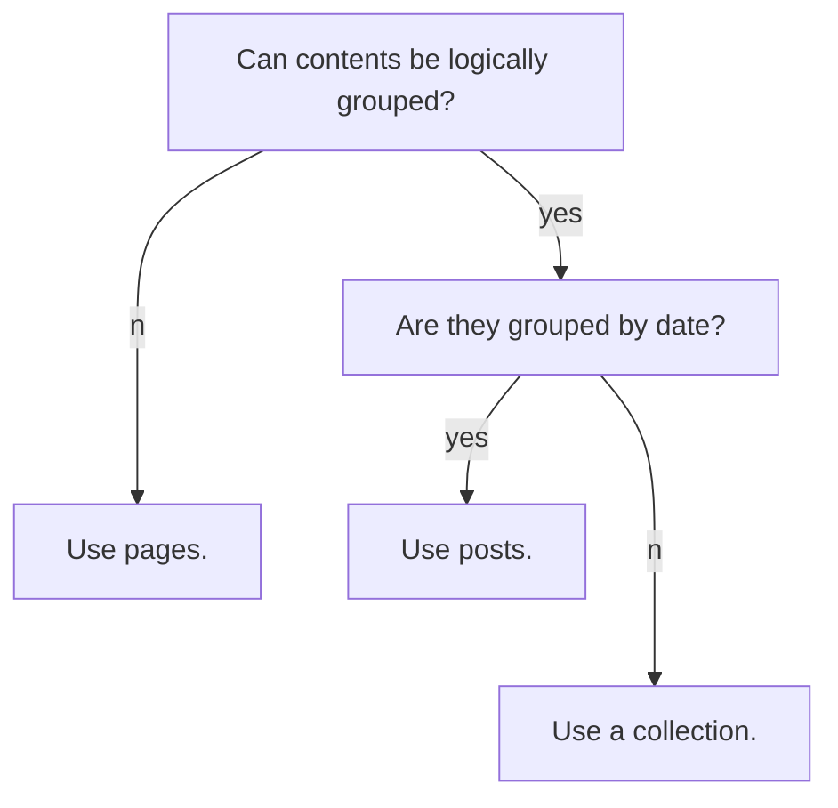

```mermaid
  graph TB;
    A[Can contents be logically grouped?]
    B[Use pages.]
    C[Are they grouped by date?]
    D[Use a collection.]
    E[Use posts.]
    A--no-->B;
    A--yes-->C;
    C--no-->D;
    C--yes-->E;
``` 

