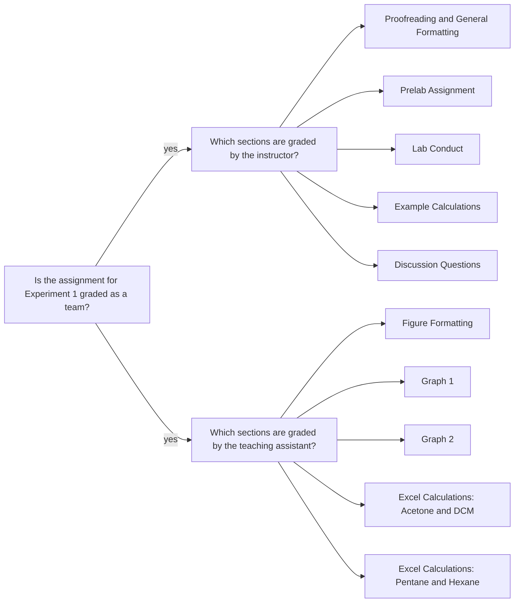

<a class="button button--outline-success button--pill button--xs" href="{{ page.course_page }}">SSQ20 CHE 139 Course Info</a>

## Goals

- Determine the moles of each pure liquid per unit area
 
$$ n_A = A_{i,l} \frac{V_l \rho_i}{M_i A^0_{i,l}} $$

- Determine the mole fraction of component A in the liquid phase
  
$$ \chi_A^l = \frac{n_A}{n_{\text{total}}} $$

- Determine the partial pressure of each component

$$ P_{i,v} = A_{i,v} \frac{P^0_i}{A^0_{i,v}} $$
 
- Generate the Raoult's law plot (see Figure 1 in the manual)

## Assignment 

- Watch the Excel workshop video for calculations and plotting expectations.
- Download the students spreadsheet for the workshop and do step by step calculations in the workshop.
- Download the data set and do the same analysis.
- Upload the Worksheet in PDF format (download the template as MS Word file and fill it out by following the instructions).
- Upload all calculations and data tables in an MS Excel file.

## Q&As 

### The area values for the pure substances

These values can be extracted from the Liquid data (the first table) and Gas data (the second table) separately. So, we will read this information as follows:

* When Part A equals to 1.0, it is `pure pentane`. Pure pentane has both liquid and gas phases.
  * Liquid area: $ 5.10 \times 10^4 ~pA.s $
  * Gas area: $ 6.19 \times 10^4 ~pA.s $
* When Part A equals to 0.0, it is `pure hexane`. Pure hexane has both liquid and gas phases.
  * Liquid area: $ 6.57 \times 10^4 ~pA.s $
  * Gas area: $ 2.82 \times 10^4 ~pA.s $

{:.border.rounded}

### Pre/postlab quizzes

These quizzes are set for unlimited attempts because 70% or higher is needed to continue the next steps. Therefore, the feedback functionality is limited on them. You would not see which questions were answered incorrectly in a previous attempt.  

### Access to the datasets

After the completion of postlab quiz with 70% or higher grade, you are allowed to download the data sets assigned to you. You may need to refresh your browser to enable the hyperlink for [Experiment 1 Raoult's Law Data](https://d2l.depaul.edu/d2l/le/content/761098/viewContent/6757299/View). 

#### Why do we have the `DCM` and `acetone` data sets?

[Experiment 1 Raoult's Law Students](https://d2l.depaul.edu/d2l/le/content/761098/viewContent/6757294/View) dataset is for only practice. This data set is used for instructional video. Students should download the `DCM` and `acetone` data and do the analysis while watching the video for the Excel workshop: [Experiment 1 Raoult's Law Excel Workshop](https://d2l.depaul.edu/d2l/le/content/761098/viewContent/6757297/View).

#### What data do I use for the worksheet?

The worksheet should be completed by using the [Experiment 1 Raoult's Law Data](https://d2l.depaul.edu/d2l/le/content/761098/viewContent/6757299/View) dataset. This data set belongs to the `hexane` and `heptane` mixture.

#### What data do I use for the Excel file?

Due to the [rubric](https://d2l.depaul.edu/d2l/le/content/761098/viewContent/6757287/View) and unlike the worksheet, your Excel file should include the analyses of both data sets: 

- `DCM` and `acetone`
- `pentane` and `hexane`

You will need to choose and report one of the data sets in the worksheet. Please make sure that you indicate which data set you chose by marking the appropriate checkbox in the worksheet. 

###  Is the assignment only a worksheet, no lab report?

Yes. This experiment has only worksheet. You do not write a lab report. 

Please see the last slide of [Experiment 1 Raoult's Law Lecture](https://d2l.depaul.edu/d2l/le/content/761098/viewContent/6768442/View) for more details.

## Team grading

If you have any questions regarding your scores, please let [me](mailto:mkahveci@depaul.edu) or your [TA](mailto:brownt1129@gmail.com) know.