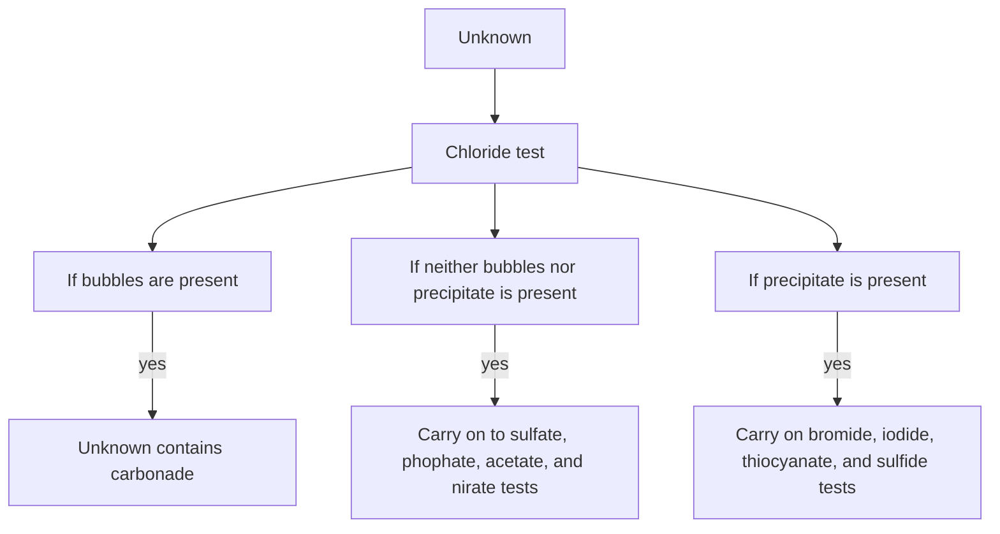
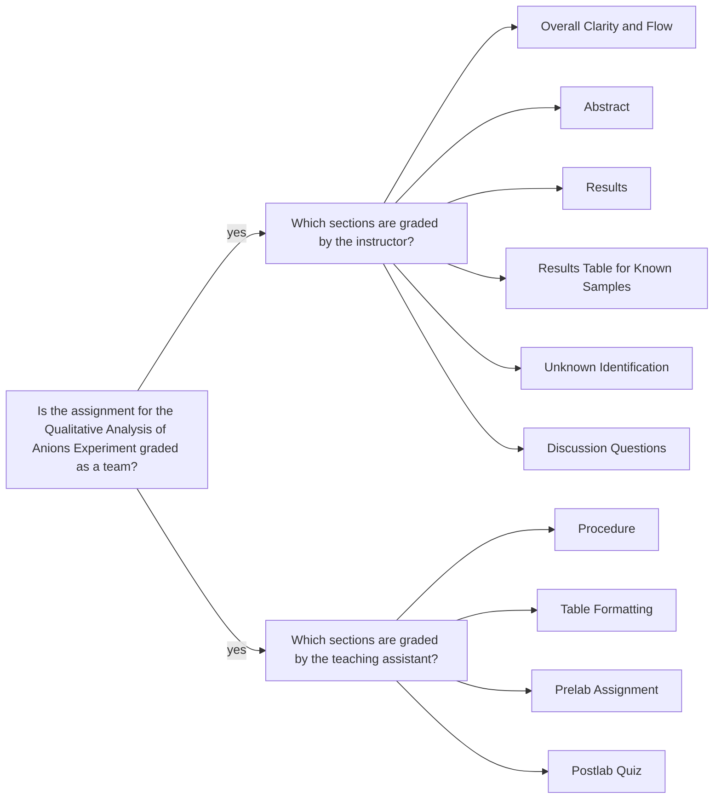

<a class="button button--outline-success button--pill button--xs" href="/tpv">SSQ20 CHE 139</a>
`Experiment 3`{:.success}

__Table of Contents__

1. TOC (numbered)
{:toc}

## Goals

* Analysis of known solutions 
    - For this experiment, you will first test a series of known samples, each containing a particular anion, according to the prescribed test for it and record your observations.
    - Download the lab notebook from the course web page, and take notes  while watching the lab video recording. So, you will rely on your careful observations and own notes. This page will not be uploaded, it is for self-study only.
    - Lab manual has enough details for preparing the sample test solutions.
* Analysis of unknown solutions 
    - You will then carry out the same analysis for two unknown samples, one from each batch of unknowns (i.e., NA \#, NB \#).
    - Using the figure below, determine the unknown sample.
    - Do not forget to note the unknown number in your lab report.

## Assignment

- Download the lab notebook from the course web page and fill it up while watching the demo video for the experiment.
- Download the data set and do the data analysis. 
- You must upload a PDF file of __partial lab report__.
- You should review the `Lab Report Guidelines`, `Sample General Chemistry Lab Report`, and `Appendix E` on D2L while writing to ensure that your drafts are correctly formatted.

## Q&As 

### Lab notebook pages

> I see in the Lab 3 instructions on your website that the lab notebook pages are used to collect the observations necessary to transfer them to the main data table in the partial lab report, would you like us to submit that file with the notebook page as well or will just the PDF of the lab report suffice?

Just the PDF of the lab report, with the required observations tables, is sufficient. The file for lab notebook pages is posted for your own use.

## Team grading

If you have any questions regarding your scores, please let [me](mailto:mkahveci@depaul.edu) or your [TA](mailto:brownt1129@gmail.com) know.