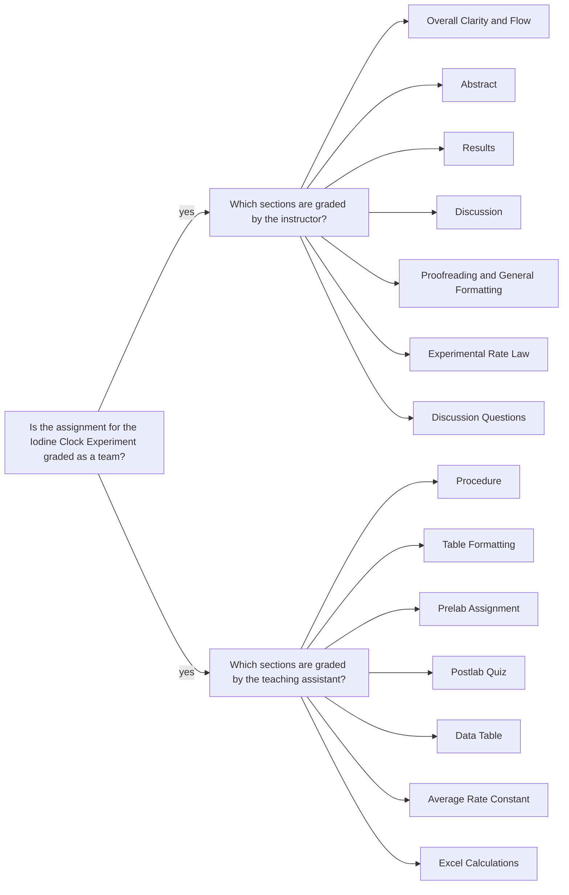

<a class="button button--outline-success button--pill button--xs" href="/tpv">SSQ20 CHE 139 Course Info</a>

## Goals

- Determine the general rate law for a chemical reaction by calculating the reaction rate for various concentrations of reactants. 

- Using the concentrations listed on the reagent bottles and the volumes in Table 2, calculate the diluted concentrations for each species using

$$ M_2 = \frac{M_1V_1}{V_2} $$

- Calculate the reaction rate for each trial using the diluted concentration of thiosulfate and the time (in seconds) it took for the blue complex to appear, using 

$$ \text{rate} = \frac{1}{2} \frac{[S_2O_3^{2-}]_i}{\Delta t} $$

- The partial order of each reactant will be found by comparing different rates and sets of concentrations to one another, yielding the experimental rate law for this specific reaction.

- Use the method of initial rates and logarithms to calculate the partial order of each reactant for the `a` and `b` set of runs separately. e.g. The ratio of `run 2` over `run 1` gives:

$$ \frac{\text{rate}_2}{\text{rate}_1}  = \frac{ k [H^{+}]^x_2 [H_2O_2^{+}]^y_2 [I^{-}]^z_2}
    {k [H^{+}]^x_1 [^{+}]^y_1 [I^{-}]^z_1}
    = 
    \Big( \frac{[I^{-}]_2}
    { [I^{-}]_1} \Big)^z
$$
 
where $$ z $$ can be found by
 
$$
   z = \frac{\log \frac{\text{rate}_2}{\text{rate}_1} }{ \log \frac{[I^{-}]_2}
    { [I^{-}]_1} }
$$

- This process is then repeated until all of the partial orders in the rate law are determined. The average partial orders should be listed to the same number of significant figures as the individual trial partial orders.

- Calculate the rate constant at that temperature using the rate and concentration data from any run

$$
  k = \frac{\text{rate}}{[H^{+}]^x [H_2O_2^{+}]^y [I^{-}]^z }
$$
  
- $$ k $$ value should be calculated for each run, which means 4 runs $$ \times $$ 2 trials $$ = 8 $$ different $$ k $$ values are calculated. 

- Report average $$ k $$ constant $$ \pm $$ standard deviation, following the rules for significant figures.

## Assignment

- Watch the demo video for the experiment
- Download the data set and do the data analysis  
- Upload the __partial lab report__ in the `PDF` format:
  - This is a deviation for the summer session only.
  - Include the following sections: `Abstract`, `Procedures`, `Results`, `Data Table`, `Experimental Rate Law`, and `Discussion` (not a full discussion section; just itemize and answer the questions.)
  - You don't need to include sample calculations in the __partial report__ (it is in Excel only), don't need to write narrative explaining data tables and calculations.
- Upload all calculations and data tables in an MS Excel file 
- You should review the `Lab Report Guidelines`, `Sample General Chemistry Lab Report`, and `Appendix E` on D2L while writing to ensure that your drafts are correctly formatted.

## Q&As 

### I was only given the concentration for $$ [H^+] $$. However I believe that I need the stock concentrations of the other reactants as well in order to be able to calculate the diluted concentration of thiosulfite. Is there something that I am missing about this?

$$ [H^+] $$ concentration was given for some data sets by mistake. These affected data sets have been updated. Please re-download your data set.

Please follow the instructions in the lecture notes. i.e. Using the concentrations listed on the reagent bottles, which are listed in Table 1, and the volumes in Table 2, calculate the diluted concentrations for each species by plugging in the values to the equation (1) on this page.

## Team grading

If you have any questions regarding your scores, please let [me](mailto:mkahveci@depaul.edu) or your [TA](mailto:brownt1129@gmail.com) know.