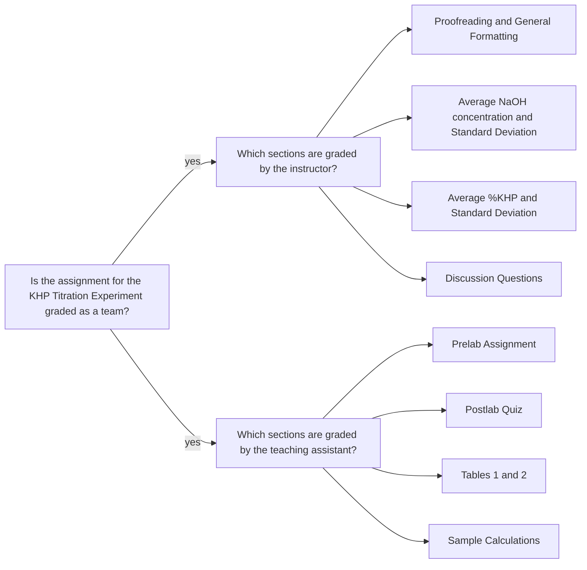

<a class="button button--outline-success button--pill button--xs" href="/tpv">CHE 139</a>
`Experiment 4`{:.success}

__Table of Contents__

1. TOC (numbered)
{:toc}

## Goals

### Calculate the molarity of standardized NaOH

- Find the moles of KHP.

$$
  n_\text{KHP} = \frac{m_\text{pure KHP}}{ 204.2212 ~\text{ g/mol}}
$$

- Determine the moles of NaOH using the stoichiometric ratio for the reaction.

$$
  n_{\text{NaOH}} = n_\text{KHP} \times  \frac{ 1 ~\text{ mol NaOH}}{ 1 ~\text{mol KHP}}
$$

- Determine the molarity of NaOH

$$
  M_\text{NaOH} = \frac{ n_{\text{NaOH}}}{ V_{\text{NaOH}}}
$$

where $$  V_{\text{NaOH}} $$ is the volume of NaOH in liters (L) to reach the endpoint.

- Calculate the average molarity of NaOH and its standard deviation. Use the average concentration value for the subsequent calculations.

### Calculate the mass of KHP in impure KHP

- Calculate the moles of base delivered when analyzing the impure KPH sample.

$$
  n_{\text{NaOH}} = V_{NaOH} \times  M_\text{NaOH}
$$

where $$  V_{\text{NaOH}} $$ is the volume of NaOH in liters (L) to reach the endpoint for impure KHP titration.

- Calculate the moles of KHP using the stoichiometric ratio for the reaction. 

$$
  n_{\text{KHP}} = n_\text{NaOH} \times  \frac{1 \text{ mol KHP }}{ 1 \text{ mol NaOH }}  
$$

- Calculate the mass of KHP in impure sample.

$$
  m_\text{KHP} =  n_{\text{KHP}} ( 204.2212 \text{ g/mol})
$$
   
- Calculate the mass percent of KHP in impure sample.

$$
  \text{mass % KHP} = \frac{m_\text{KHP}}{ m_\text{impure sample}} \times 100\%
$$
  
- Calculate the average mass percent KHP and its standard deviation. Report the unknown number of the sample as well.

## Assignment

- Print out pages 7-11 of the lab manual and respond to all prompts in a clearly written and well-organized manner. 
- Presentation matters; sloppy and illegible work will not score well. 
- Your goal is to use the space provided to communicate your understanding of this experiment. 
- Scan and upload your work as a single PDF file by its deadline. You do not need to upload an Excel file for this experiment.
- You should review the `Lab Report Guidelines`, `Sample General Chemistry Lab Report`, and `Appendix E` on D2L while writing to ensure that your drafts are correctly formatted.

## Q&As

### Having double burette readings for a trial

> I was wondering why each trial had two initial burette volumes and two final burette volumes instead of just one.

If the burette is to be refilled before the titration ends, you would have two readings of initial and final values. Another reason could be if you are delivering more than 50 mL volume. You would just sum the amount delivered for each reading.

## Team grading

If you have any questions regarding your scores, please let [me](mailto:mkahveci@depaul.edu) or your [TA](mailto:brownt1129@gmail.com) know.