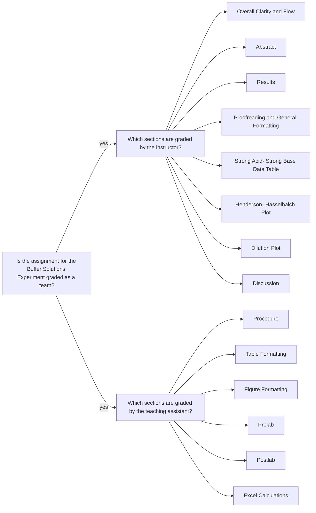

<a class="button button--outline-success button--pill button--xs" href="/tpv">SSQ20 CHE 139</a>
`Experiment 6`{:.success}

__Table of Contents__

1. TOC (numbered)
{:toc}

## Goals

#### Prepare the buffers A1-E1

- Calculate the concentration of each component present in buffers A1-E1 using the concentration of each stock solution, the volume of each solution delivered, and the total volume of buffer created.

Solution | Volume (mL) of $$CH_3COOH$$ or $$NH_4Cl$$ | Volume (mL) of $$CH_3COONa$$ or $$NH_3$$ |
|:-:|:-:|:-:|
A1 | 15.00 | 15.00 |
B1 | 20.00 | 10.00 |
C1 | 25.00 | 5.00 |
D1 | 5.00 | 25.00 |
E1 | 10.00 | 20.00 |

#### Generate the plot of pH vs. $$ \log \frac{ [base] }{ [acid] } $$

- Fit the data to a line (i.e. trendline). 
- Calculate the slope (3 sig. figs required) using `=SLOPE()` function in Excel.
- Calculate the intercept (3 sig. figs required) using `=INTERCEPT()` function in Excel.

#### Generate the plot pH vs. the logarithm of the dilution factor

- Generate a single scatter plot of pH vs. the logarithm of the dilution factor (1, 10, 100) for each buffer component using Excel.
- Both data sets should be presented on the same plot.
- Do not fit the data to a trendline.

## Assignment

- Watch pH meter calibration video
- Watch the videos, pass the postlab quiz, and download your data set for Experiment 6
- Analyze the data in Excel
- Submit your partial lab report in a PDF file and all calculations in an Excel file.
- You should review the `Lab Report Guidelines`, `Sample General Chemistry Lab Report`, and `Appendix E` on D2L while writing to ensure that your drafts are correctly formatted.

## Q&As

No incoming questions for this experiment.

## Team grading

If you have any questions regarding your scores, please let [me](mailto:mkahveci@depaul.edu) or your [TA](mailto:brownt1129@gmail.com) know.