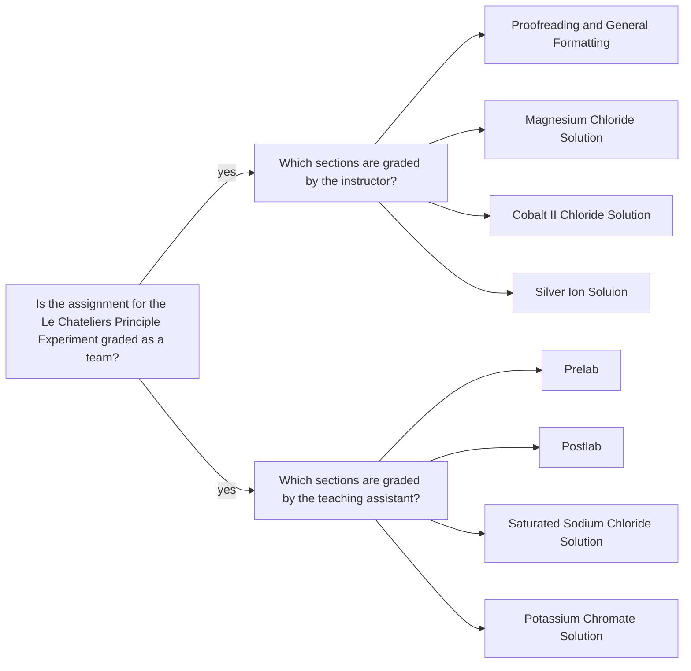

<a class="button button--outline-success button--pill button--xs" href="/tpv">SSQ20 CHE 139</a>
`Experiment 7`{:.success}

__Table of Contents__

1. TOC (numbered)
{:toc}

## Goals

- Observe the effect of adding mixing various solutions or changing the temperature of a solution.
- Explain the observations using the relevant chemical reactions and Le Châtelier's principle.
- Be through!  
  - Do not simply state "Sodium hydroxide was added and the reaction shifted left."
  - See Figure 1 and 2 for some ideas





## Assignment

- Watch the videos, pass the postlab quiz, and download the Word document worksheet posted.
- Make careful observations.
- Type your responses on the Word document.
- Still photos are shown in addition to the video content to allow you to see the results more clearly.
  - For precipitates, describe the color, apparent consistency.
  - For translucent solutions, state the color and the depth of color (dark, light, etc.).
  - Note the formation of gas bubbles and any comments regarding temperature changes.
- Upload your final worksheet as a PDF document.
- You should review the `Lab Report Guidelines`, `Sample General Chemistry Lab Report`, and `Appendix E` on D2L while writing to ensure that your drafts are correctly formatted.

## Q&As

No incoming questions for this experiment.

## Team grading

If you have any questions regarding your scores, please let [me](mailto:mkahveci@depaul.edu) or your [TA](mailto:brownt1129@gmail.com) know.