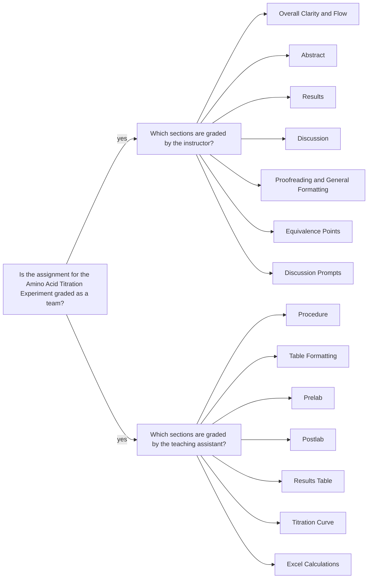

<a class="button button--outline-success button--pill button--xs" href="/tpv">SSQ20 CHE 139</a>
`Experiment 8`{:.success}

__Table of Contents__

1. TOC (numbered)
{:toc}

## Goals

#### Identification of the unknown amino acid

- Plot a graph of $$pH$$ vs. $$V(mL)$$ of $$NaOH$$ added. 
- If a break (or breaks, in the case of polyprotic acids) is clearly visible, estimate the pKa (or multiple $$pKa$$ values in the case of polyprotic acids).
- Use the example titration curve in the previous slide as a guidance:
  - The vertical dashed line shows equivalence point and corresponding $$NaOH$$ volume.
  - The horizontal dashed line shows $$pH$$ value, which is equal to $$pKa$$ value. So, you determined the $$pKa$$ value. 
  - Repeat this process for each break if you have multiple breaks and determine all $$pKa$$ values.  
- Estimate the molar mass of the acid. 
- Use these data to find a match in Table 2, Table 3, or Table 4.

#### Calculate the molar mass of the acid

- At the equivalence point:

\begin{equation}
  \text{mol } OH^- = \text{mol amino acid}
\end{equation}

which means:

\begin{equation}
  \text{volume of } OH^- \times \frac{\text{mol } OH^-}{ \text{L} } \times \frac{ 1 \text{ mol amino acid}}{ 1 \text{ mol } OH^-} = \text{mol amino acid} 
\end{equation}

- Calculate molar mass using the moles of amino acid and the mass of sample.

\begin{equation}
  \text{molar mass of amino acid} = \frac{\text{g amino acid}}{\text{mol amino acid}}
\end{equation}

#### Determine the identity of amino acid

- Using the $$pKa$$ and molar mass values determine the identity of amino acid.
- Find a match in Table 2, Table 3, or Table 4.

## Assignment

- Watch the videos, pass the postlab quiz, and download your data set.
- Analyze the data in Excel
- Submit your partial lab report in PDF and all calculations in Excel file.
- You should review the `Lab Report Guidelines`, `Sample General Chemistry Lab Report`, and `Appendix E` on D2L while writing to ensure that your drafts are correctly formatted.

## Q&As

No incoming questions for this experiment.

## Team grading

If you have any questions regarding your scores, please let [me](mailto:mkahveci@depaul.edu) or your [TA](mailto:brownt1129@gmail.com) know.