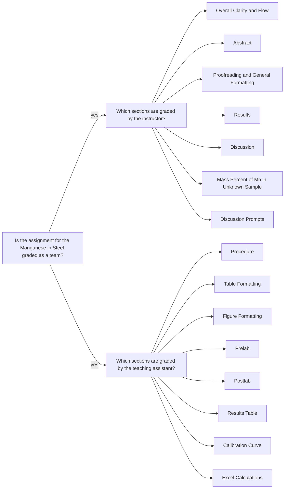

<a class="button button--outline-success button--pill button--xs" href="/tpv">SSQ20 CHE 139</a>
`Experiment 10`{:.success}

__Table of Contents__

1. TOC (numbered)
{:toc}

## Goals

- Generate a standard curve (absorbance at  525 nm vs. concentration of $$MnO_4^-$$ in M) for the solutions of known $$MnO_4^-$$ concentration.
- Use the standard curve to calculate the concentration of $$MnO_4^-$$ in a solution generated from a steel sample.
- Calculate percent Mn in the steel sample from the $$MnO_4^-$$ concentration.

## Assignment

- Compare the molar absorptivity from your plot to the literature value
given in the lab instructions.
- Read the lab instructions carefully so you can explain why you do or do not have to worry about $$Cu^{2+}$$ and $$Ni^{2+}$$ ions interfering with your results.
- Think through how a molar absorptivity that is too low would affect your results. To answer this correctly, follow the computational steps to make sure you can clearly state if an a value that is too small will lead to a higher or lower percent Mn than the correct value.
- Incorporate the responses to the above prompts in your overall discussion. Be sure to discuss the quality of your fit, the spread in the absorbance readings for the unknown, etc. to ensure your discussion is complete.
- Watch the videos, pass the postlab quiz, and download your data set.
- Submit your __full lab report__ in a PDF file and __calculations__ in an Excel file.
- You should review the `Lab Report Guidelines`, `Sample General Chemistry Lab Report`, and `Appendix E` on D2L while writing to ensure that your drafts are correctly formatted.

## Q&As

No incoming questions for this experiment.

## Team grading

If you have any questions regarding your scores, please let [me](mailto:mkahveci@depaul.edu) or your [TA](mailto:brownt1129@gmail.com) know.