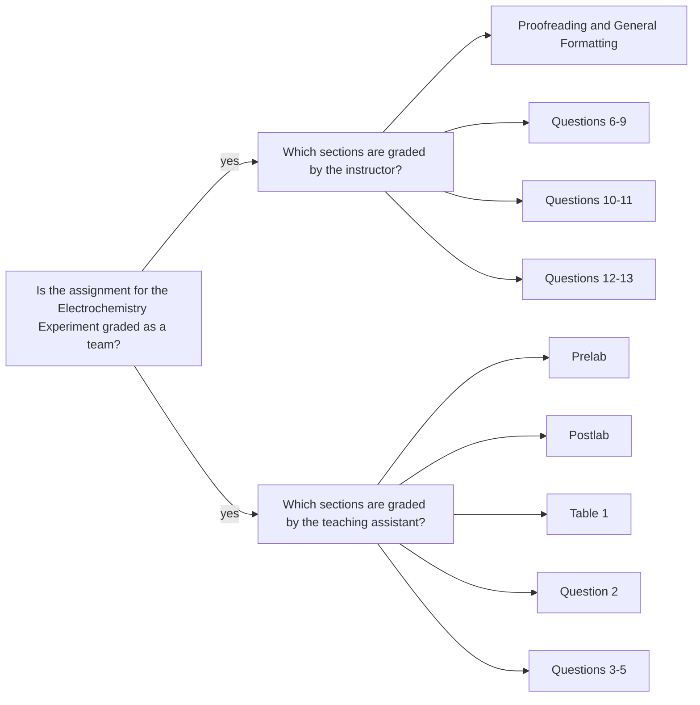

<a class="button button--outline-success button--pill button--xs" href="/tpv">SSQ20 CHE 139</a>
`Experiment 11`{:.success}

__Table of Contents__

1. TOC (numbered)
{:toc}

## Goals

- It is important that you identify the cathode and anode half-reactions for each galvanic cell before beginning the following calculations.

#### Experimental $$E$$ for $$Cu$$

- From the standard reduction potential, $$E^\circ$$, of the copper half-reaction of 0.340 V and the concentration of $$Cu^2+$$, calculate the actual value of $$E$$ for the experimental copper half-reaction using the Nernst equation (Equation \ref{nerst}).

\begin{equation}\label{nerst}
  E_\text{red} = E_\text{red}^\circ - \Big( \frac{RT}{nF} \Big) \ln \Big( \frac{1}{[M^{n+}]} \Big)
\end{equation}

#### Experimental $$E$$ for $$Al$$

From the actual value of E for the experimental copper half-reaction and the measured value of Εcell for the copper-aluminum cell, determine the value of E for the experimental half-reaction for aluminum (Equation \ref{Ecell}).

\begin{equation}\label{Ecell}
  E_\text{cell} = E_\text{cathode} - E_\text{anode}
\end{equation}

#### Experimental $$E^\circ$$ for $$Al$$

From the calculated value of $$E$$ for the experimental aluminum half-reaction and the actual
concentration of $$Al^{3+}$$, calculate $$E^\circ$$ for the aluminum half-reaction using the Nernst equation (Equation \ref{nerst}).

#### Experimental $$E$$ for $$Zn$$

From the actual value of $$E$$ for the experimental copper half-reaction and the measured value of Εcell for the copper-zinc cell, determine the value of E for the experimental half-reaction for zinc (Equation \ref{Ecell}).

#### Experimental $$E^\circ$$ for $$Zn$$

From the calculated value of $$E$$ for the experimental zinc half-reaction and the actual concentration
of $$Zn^{2+}$$, calculate $$E^\circ$$ for the zinc half-reaction using the Nernst equation (Equation \ref{nerst}).

#### Experimental $$E$$ for $$Pb$$

From the actual value of $$E$$ for the experimental copper half-reaction and the measured value of Εcell for the copper-lead cell, determine the value of $$E$$ for the experimental half-reaction for lead (Equation \ref{Ecell}).

#### Experimental $$E^\circ$$ for $$Pb$$

From the calculated value of E for the experimental lead half-reaction and the actual concentration
of $$Pb^{2+}$$, calculate $$E^\circ$$ for the lead half-reaction using the Nernst equation (Equation \ref{nerst}).

#### Internal Consistency Check

Using the experimental $$E$$ values for zinc and lead calculated above, calculate $$E_\text{cell}$$. Compare this result to the value you measured.

## Assignment

- Watch the videos, pass the postlab quiz, and download your data set.
- Analyze the data in Excel.
- Submit your worksheet in a PDF file.
- You should review the `Lab Report Guidelines`, `Sample General Chemistry Lab Report`, and `Appendix E` on D2L while writing to ensure that your drafts are correctly formatted.

## Q&As

No incoming questions for this experiment.

## Team grading

If you have any questions regarding your scores, please let [me](mailto:mkahveci@depaul.edu) or your [TA](mailto:brownt1129@gmail.com) know.