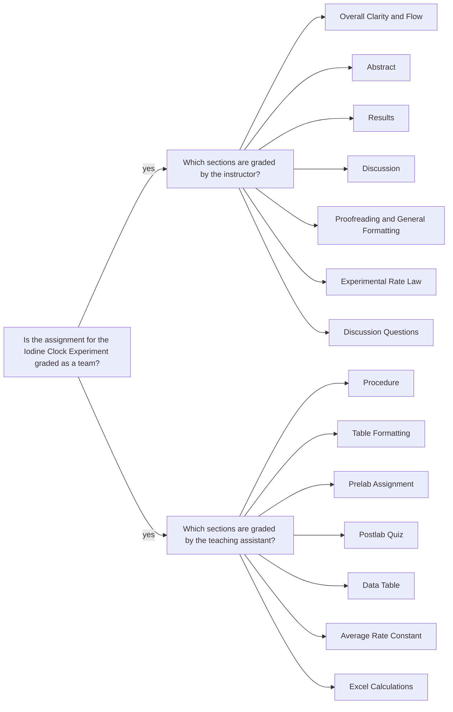

<a class="button button--primary button--pill" href="/tpv">SSQ20 CHE 139</a>
`Experiment 2`{:.success}

__Table of Contents__

- TOC (numbered)
{:toc}

## 1 Goals

- Determine the general rate law for a chemical reaction by calculating the reaction rate for various concentrations of reactants. 

- Using the concentrations listed on the reagent bottles and the volumes in Table 2, calculate the diluted concentrations for each species using

\begin{equation}\label{eq:dilution}
  M_2 = \frac{M_1V_1}{V_2}
\end{equation}

- Calculate the reaction rate for each trial using the diluted concentration of thiosulfate and the time (in seconds) it took for the blue complex to appear, using 

$$ \text{rate} = \frac{1}{2} \frac{[S_2O_3^{2-}]_i}{\Delta t} $$

- The partial order of each reactant will be found by comparing different rates and sets of concentrations to one another, yielding the experimental rate law for this specific reaction.

- Use the method of initial rates and logarithms to calculate the partial order of each reactant for the `a` and `b` set of runs separately. e.g. The ratio of `run 2` over `run 1` gives:

\begin{equation}\label{eq:rateratios}
 \frac{\text{rate}_2}{\text{rate}_1}  = \frac{ k [H^{+}]^x_2 [H_2O_2^{+}]^y_2 [I^{-}]^z_2}
    {k [H^{+}]^x_1 [^{+}]^y_1 [I^{-}]^z_1}
    = 
    \Big( \frac{[I^{-}]_2}
    { [I^{-}]_1} \Big)^z
\end{equation}
 
where $$ z $$ can be found by
 
\begin{equation}\label{eq:porder}
   z = \frac{\log \frac{\text{rate}_2}{\text{rate}_1} }{ \log \frac{[I^{-}]_2}
    { [I^{-}]_1} }
\end{equation}

- This process is then repeated until all of the partial orders in the rate law are determined. The average partial orders should be listed to the same number of significant figures as the individual trial partial orders.

- Calculate the rate constant at that temperature using the rate and concentration data from any run

$$
  k = \frac{\text{rate}}{[H^{+}]^x [H_2O_2^{+}]^y [I^{-}]^z }
$$
  
- $$ k $$ value should be calculated for each run, which means 4 runs $$ \times $$ 2 trials $$ = 8 $$ different $$ k $$ values are calculated. 

- Report average $$ k $$ constant $$ \pm $$ standard deviation, following the rules for significant figures.

## 2 Assignment

- Watch the demo video for the experiment
- Download the data set and do the data analysis  
- Upload the __partial lab report__ in the `PDF` format:
  - This is a deviation for the summer session only.
  - Include the following sections: `Abstract`, `Procedures`, `Results`, `Data Table`, `Experimental Rate Law`, and `Discussion` (not a full discussion section; just itemize and answer the questions.)
  - You don't need to include sample calculations in the __partial report__ (it is in Excel only), don't need to write narrative explaining data tables and calculations.
- Upload all calculations and data tables in an MS Excel file 
- You should review the `Lab Report Guidelines`, `Sample General Chemistry Lab Report`, and `Appendix E` on D2L while writing to ensure that your drafts are correctly formatted.

## 3 Q&As 

### 3.1 Concentrations of the stock solutions

> I was only given the concentration for $$ [H^+] $$. However I believe that I need the stock concentrations of the other reactants as well in order to be able to calculate the diluted concentration of thiosulfite. Is there something that I am missing about this?

$$ [H^+] $$ concentration was given for some data sets by mistake. These affected data sets have been updated. Please re-download your data set and assume that the stock solutions are exactly prepared in the suggested values in Table 1.

_Table 1. The concentrations of stock solutions._

Hydrochloric acid | 0.0500 M 
Hydrogen peroxide | 0.5000 M 
Potassium iodide | 0.0500 M 
Sodium thiosulfate | 0.0100 M

### 3.2 Calculating the initial concentrations

> We're supposed to calculate $$ M_2 $$ using data from Table 2. I'm not sure which volume to use with regards to runs since they change for different runs. Do I need to find $$ M_2 $$ of all reactants for all 4 runs? Or do I just need to find $$ M_2 $$ for a specific run? 

Using the stock concentrations listed in Table 1 and the volumes in Table 2, calculate the diluted concentrations for each species by plugging in the values to Equation \ref{eq:dilution}. These calculated concentrations are known as initial concentrations.



For example, the intial concentration of hydrogen peroxide Run 1:

$$ M_{H_2O_2} = \frac{(0.5000 \text{ M}))(10.00 \text{ mL})}{50.00 \text{ mL}} = 0.1000 \text{ M} $$ (4 sig. figs.)

For Run 1, you will do this calculation for all species across the line. These values are the initial concentrations for Run 1. Repeat this calculation for all 4 runs and plug into Equation \ref{eq:rateratios} to find the partial orders of $$x$$, $$y$$, and $$z$$.

_Please note that you are expected to make an Excel table and do all of these individual calculations by using Excel functions._

## 4 Assessment

### 4.1 Misconceptions

#### 4.1.1 Determining partial orders

> The partial order of each reactant is the same value of the stoichiometric number or the exponent linked to a particular reactant.

Incorrect. Partial orders are experimentally determined using the initial concentrations. See Equations \ref{eq:rateratios} and \ref{eq:porder} for more details.

>  If the concentration of $$HCl$$ were doubled, the reaction time would not change because
thiosulfate is the limiting reactant and therefore the reaction time is dependent upon the
consumption of thiosulfate. The concentration of $$H_2O_2$$ and $$KI$$ do not effect the reaction
time since the reaction time depends on the consumption of thiosulfate, the limiting
reactant.

This explanation is based on the following rate law:  $$rate = k [H_2O_2]^1 [HCl]^1[KI]^1$$. If all partial orders are determined as 1, which is incorrect for this experiment, then every species would affect the reaction rate in the same proportion. e.g. If the concentration of $$HCl$$ or $$H_2O_2$$ or $$KI$$ were doubled, the reaction time would be half.

#### 4.1.2 If the concentration of HCl were doubled, how would the reaction time change? How does the concentration of $$H_2O_2$$ affect the reaction time? How does the concentration of $$KI$$ affect the reaction time?

> If the concentration of $$HCl$$ were doubled, the reaction time would increase. The concentration of $$H_2O_2$$ would slow down the reaction time. The concentration of $$KI$$ would speed up the reaction time.

> This would increase the reaction time because there is more concentration so the reaction
would take longer than it would have originally.

You would need to base your discussion on the experimental rate law that you discovered. If the species of interest has nonzero partial oder, than you would be able to relate its concentration to the overall reaction rate. 

Please remember that scientific argument is only valid (i.e. viable) if it is based on evidence. Thefore, you must use all the evidences you gathered in this experiment to answer these questions.

Another hint is that the question itself guides you to talk about some species, like $$H_2O_2$$ and $$KI$$. 

> Increasing any of the concentrations would allow for a faster rate to be observed. The reason behind
this is that there are more particles in an increased concentration which allows for more collisions to
happen. This would entail a faster reaction rate.

The rate law should be experimentally determined to answer this question.

> The experimental rate law for the reaction was $$k = [H_2O_2]^0[H^+]^0[I^-]^1$$. If the concentration of $$HCl$$ was doubled, The rate constant would increase. This is because the rate constant is relative to the temperature.

Two issues: 

1. The rate law should be written as $$ rate = k [H_2O_2]^0[H^+]^0[I^-]^1$$ (may show some incorrect partial orders for this experiment)
1. You just experimentally determined that acid concentration does not affect the rate of the reaction. Mathematically speaking, $0^{th}$ power of $$[H^+]$$ means that $$[H^+]$$ does not affect the reaction rate. e.g. $$ (.5 \text{ M})^0 = (.05 \text{ M})^0 = ... = 1 $$

#### 4.1.3 Would you expect the rate constant to change if you heated up the reactants before mixing? Why or why not? If the rate constant would change, would it be larger or smaller than at room temperature?

> Yes, the rate constant would change if it were heated up. This would make the heat
constant smaller because the time of the reaction would decrease.

I see two issues here. 

1. You say that `if the rate constant were heated up`. Well, the rate constant is a concept; you cannot heat it up. Perhaps you meant the reaction vessel was heated up but it was not clear. Again, in a scientific argument we read what you say, as you say it. You have the observations and you have the power to make claims. 

2. You said `the heat constant`. What do you mean? We did not define `heat constant` as a term in this context.

> The rate constant would change if the reactants were to be heated up before mixing, the heat would increase the concentration which then would also increase the rate constant.

Again, there are two issues here:

1. You have no evidence to claim that `the heat would increase the concentration`.
2. Even if so, increasing concentration does not necessarily increase the rate constant. Hint: consider $$0^{th}$$ order reaction.

#### 4.1.4 How would a wet pipette affect the experimental results?

> A wet pipette would change the experimental results in that it would increase the concentrations of the mixtures.

A wet pipette means that the solution is diluted.

> A wet pipette could affect the experimental results significantly by increasing the delivered
volume value, therefore making the experimental results inaccurate and inconsistent.

Disagree. Volume is measured correctly all the time by the use of pipette.

### 4.2 Formatting issues

> If the concentration of HCl, H2O2, and KI were doubled the reaction time would also
double (increase).

You should use an equation editor to write equations and chemical formulas properly. i.e. I expect to see $$H_2O_2$$ rather than H2O2.

> H202(aq) + 2I-(aq) yields 2 H20(l) + I2(aq)

You must use the equation editor for all equations and chemical formulas. So, I expect:

$$
H_20_2\text{(aq)} + 2I^-\text{(aq)} \rightarrow 2 H_20\text{(l)} + I_2\text{(aq)} \notag
$$
 
### 4.3 Issues with calculations

> The overall reaction for Reaction 3 is determined by the sum of x, y and z. The sum is equal to
2.212.

Although the sum of partial orders can be a fractional number in rare cases, normally at this level yu learn whole numbers only. So, it would be in a sense necessary to properly round your final results. Remember that you learnt only $$0^{th}$$, $$1^{st}$$, and $$2^{nd}$$ order reactions. We do not always explicitly say all details but you can use common sense when you do experiments and data analysis.

> ...the rate constant being $$1.39 \times 10^{−6} \text{ M}^{−1} \text{.s} \pm 2.64 \times 10^{−6}$$.

There issues:

1. Value and standard deviation do not share a common multiplier, when a multiplier is present.
1. Standard deviation does not have a unit.
2. Rules for significant figures are not followed. 

The expected format is: $$ (1 \pm 3) \times 10^{−6} \text{ M}^{−1} \text{.s} $$

- Standard deviation has 1 sig. fig. (requirement)
- The value has zero decimal place —same as the standard deviation (requirement)

> [A value from a table cell given as] 5.88E-05

This format is how Excel handles exponential values however it is not the scientific notation. Instead, you should use: $$5.88 \times 10^{-5}$$. 

### 4.4 Feedback

- The PDF file you uploaded: annotations are highlighted with gray background and pink font.
- E-Rubric: D2L will show the rubric with scores and any feedback provided.

### 4.5 Grades 

| Term Statistics[^1] |	Average | Stdev |	Median |	Maximum |	Minimum |
|:-:|:-:|:-:|:-:|:-:|:-:|
| SSQ 2020 |	76.06% | 8.51% |	73.50% |	95.50% |	61.50% |

[^1]: All zero values are excluded.

### 4.6 Team grading

If you have any questions regarding your scores, please let [me](mailto:mkahveci@depaul.edu) or your [TA](mailto:brownt1129@gmail.com) know.