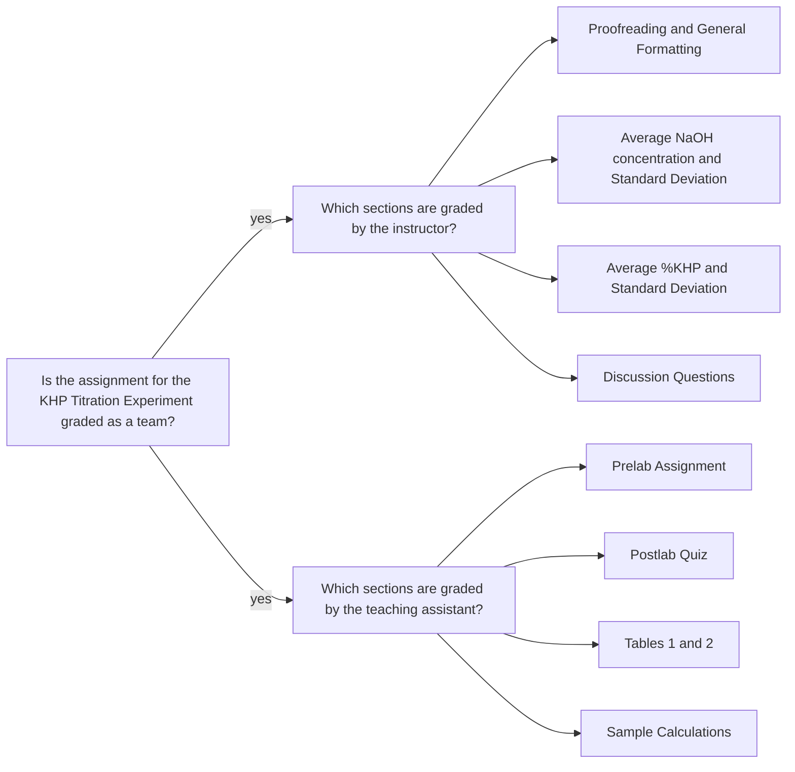

<a class="button button--primary button--pill" href="/tpv">SSQ20 CHE 139</a>
`Experiment 4`{:.success}

__Table of Contents__

* TOC (numbered)
{:toc}

## 1 Goals

### 1.1 Calculate the molarity of standardized NaOH

- Find the moles of KHP.

$$
  n_\text{KHP} = \frac{m_\text{pure KHP}}{ 204.2212 ~\text{ g/mol}}
$$

- Determine the moles of NaOH using the stoichiometric ratio for the reaction.

$$
  n_{\text{NaOH}} = n_\text{KHP} \times  \frac{ 1 ~\text{ mol NaOH}}{ 1 ~\text{mol KHP}}
$$

- Determine the molarity of NaOH

$$
  M_\text{NaOH} = \frac{ n_{\text{NaOH}}}{ V_{\text{NaOH}}}
$$

where $$  V_{\text{NaOH}} $$ is the volume of NaOH in liters (L) to reach the endpoint.

- Calculate the average molarity of NaOH and its standard deviation. Use the average concentration value for the subsequent calculations.

### 1.2 Calculate the mass of KHP in impure KHP

- Calculate the moles of base delivered when analyzing the impure KPH sample.

$$
  n_{\text{NaOH}} = V_{NaOH} \times  M_\text{NaOH}
$$

where $$  V_{\text{NaOH}} $$ is the volume of NaOH in liters (L) to reach the endpoint for impure KHP titration.

- Calculate the moles of KHP using the stoichiometric ratio for the reaction. 

$$
  n_{\text{KHP}} = n_\text{NaOH} \times  \frac{1 \text{ mol KHP }}{ 1 \text{ mol NaOH }}  
$$

- Calculate the mass of KHP in impure sample.

$$
  m_\text{KHP} =  n_{\text{KHP}} ( 204.2212 \text{ g/mol})
$$
   
- Calculate the mass percent of KHP in impure sample.

$$
  \text{mass % KHP} = \frac{m_\text{KHP}}{ m_\text{impure sample}} \times 100\%
$$
  
- Calculate the average mass percent KHP and its standard deviation. Report the unknown number of the sample as well.

## 2 Assignment

- Print out pages 7-11 of the lab manual and respond to all prompts in a clearly written and well-organized manner. 
- Presentation matters; sloppy and illegible work will not score well. 
- Your goal is to use the space provided to communicate your understanding of this experiment. 
- Scan and upload your work as a single PDF file by its deadline. You do not need to upload an Excel file for this experiment.
- You should review the `Lab Report Guidelines`, `Sample General Chemistry Lab Report`, and `Appendix E` on D2L while writing to ensure that your drafts are correctly formatted.

## 3 Q&As

### 3.1 Having double burette readings for a trial

> I was wondering why each trial had two initial burette volumes and two final burette volumes instead of just one.

If the burette is to be refilled before the titration ends, you would have two readings of initial and final values. Another reason could be if you are delivering more than 50 mL volume. You would just sum the amount delivered from each reading.

## 4 Assessment

### 4.1 Misconceptions

> If the sample did not completely dry, the mass reading would have overestimated the true value because there would be weight in water attributing to the reading.

Should consider mathematically. _Hint:_ Does moisture affect the mol amount of KHP in the sample?

> ... If the volume increases then the concentration of the sample would increase as well.

How? Again, please consider mathematically. e.g. Consider the formula, where the mol amount, $$n$$, is constant:

$$ M = \frac{n}{V} $$

What do you expect about the trend when $$V$$ gets larger?

### 4.2 Formatting issues

> 0.08692 M ± 0.000212

Two issues:
- Incorrect sig.figs. 
- Standard deviation has no unit

Should be reported as $$ 0.0869 \pm 0.0002 $$ M or preferably using the scientific notation: $$ (8.69 \pm 0.02) \times 10^{-2} $$ M

- Rules applied:
  - Standard deviation is rounded to 1 sig. fig. (requirement)
  - Average value is matched to the decimal place in the standard deviation (requirement) (also see [this example](/ykf#42-formatting-issues))

### 4.2 Feedback

- The PDF file you uploaded: annotations are highlighted with gray background and pink font.
- E-Rubric: D2L will show the rubric with scores and any feedback provided.

### 4.3 Grades 

| Term Statistics[^1] |	Average | Stdev |	Median |	Maximum |	Minimum |
|:-:|:-:|:-:|:-:|:-:|:-:|
| SSQ 2020            |	78.19%  | 13.02% |	81.75% |	96.50% |	58.00% |

[^1]: All zero values are excluded.

### 4.4 Team grading

If you have any questions regarding your scores, please let [me](mailto:mkahveci@depaul.edu) or your [TA](mailto:brownt1129@gmail.com) know.