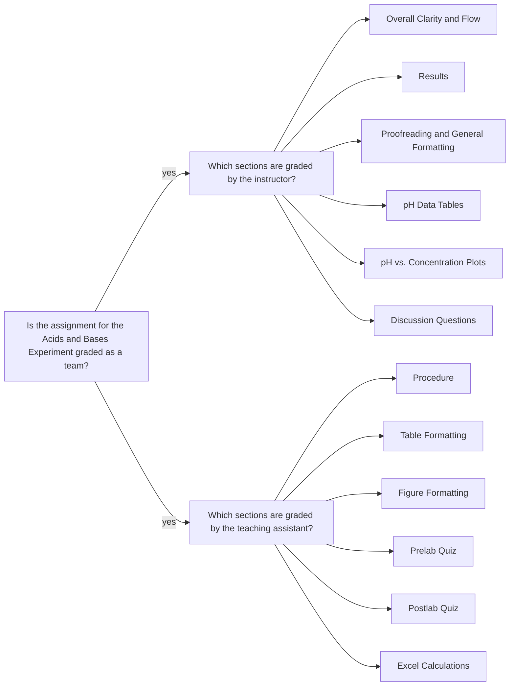

<a class="button button--primary button--pill" href="/tpv">CHE 139</a>
`Experiment 5`{:.success}

__Table of Contents__

* TOC (numbered)
{:toc}

## 1 Goals

### 1.1 Examine the effect of dilution on the pH of strong and weak acids and bases

- Calculate, using $$ M_1V_1 = M_2V_2 $$, the concentration of HCl, NaOH, CH$$_3$$COOH, and NH$$_4$$OH for the 1:10 and 1:100 diluted solutions and the mixtures.

- Calculate $$[H_3O^+]$$ for each solution using the measured pH values and Equation $$ \ref{eq:H3O} $$.
  
\begin{equation}\label{eq:pH}
  pH = - \log [H_3O^+]
\end{equation}

\begin{equation}\label{eq:H3O}
  \text{[H}_3\text{O}^+\text{]} = 10^{-\text{pH}}
\end{equation}

- Make a plot of pH vs. concentration for HCl and CH$$_3$$COOH, and another for NaOH and NH$$_4$$OH.

- The strong and weak species should show a different dependence of pH on concentration.

### 1.2 Calculating the values of $$  K_a $$ and $$  K_b $$

\begin{equation}\label{eq:Ka}
  K_a = \frac{ [A^-][H_3O^+] }{ [HA]}
\end{equation}

where, $$[H_2O]$$ is omitted because it is pure liquid.

\begin{equation}\label{eq:Kb}
  K_b = \frac{ [BH^+][OH^-] }{ [B] }
\end{equation} 

where, $$[H_2O]$$ is omitted because it is pure liquid.

\begin{equation}\label{eq:percent-ionization-acid}
  \% \text{ ionization} = \frac{ [H_3O^+]}{ [HA]_0} \times 100\% =  \frac{ [A^-] }{ [HA]_0 } \times 100\%
\end{equation}

\begin{equation}\label{eq:percent-ionization-base}
  \% \text{ ionization} = \frac{ [BH^+] }{ [B]_0 } \times 100\% = \frac{ [OH^-] }{ [B]_0 } \times 100\%
\end{equation}

- Calculate $$  K_a $$ using Equation \ref{eq:Ka},
- Calculate $$ K_b $$ using Equation \ref{eq:Kb},
- Calculate the percent dissociation of the weak acid using Equation \ref{eq:percent-ionization-acid}, and
- Calculate the percent dissociation of the weak base using Equation \ref{eq:percent-ionization-base}.

### 1.3 Examine the pH of mixtures of strong and weak acids and bases

- Examine the pH of mixtures of strong and weak acids and bases to see how the presence of a strong acid or base impacts the percent dissociation of the weak acid or base.

- Calculate the percent dissociation of the weak acid using Equation \ref{eq:percent-ionization-acid}, and
- Calculate the percent dissociation of the weak base using Equation \ref{eq:percent-ionization-base}.

## 2 Assignment

- Watch pH meter calibration video
- Watch solution preparation and pH determination video
    - Only shown for HCl; same process used for other solutions
- Take the post-lab quiz with a 70% or higher
- Download the data set and do the data analysis  
- You must upload a PDF file of __partial lab report__:
    - This is a deviation for the summer session only
    - Include the following sections: `Procedures`, `Results`, `pH Data Tables`, `pH vs. Concentration Plots`, and `Discussion` (not a full discussion section; just itemize and answer the questions.)
    - You don't need to include sample calculations in the partial report (it is in Excel only), don't need to write narrative explaining data tables and calculations.
- You must upload all calculations and data tables in an MS Excel file 
- You should review the `Lab Report Guidelines`, `Sample General Chemistry Lab Report`, and `Appendix E` on D2L while writing to ensure that your drafts are correctly formatted.

## 3 Q&As

### 3.1 Calculating the concentration of 1:10 and 1:100 solutions

> I think $$V_1$$ for stock solutions is 50 mL, but can’t figure out what $$V_1$$ is for 1:10 (10 mL ?) and 1:100 dilutions. I want to confirm that $$M_1$$ is 1.0 M for all calculations and $$V_2$$ is 100 mL. I’ve looked at the lab procedure and lab video, but get confused about the process of dilutions regarding volumes of $$V_1$$.

As an example, I will walk through the concentration calculations for the  hydrochloric acid dilutions.

The concentration of the stock solution,  $$M_1 = 1.00 \text{ M} $$ (let's use 3 sig. figs.)

where `1` means initial state. Likewise,  we would use `2` to indicate the final state.

### 3.2 10-fold or 1:10 dilution

`Dilute the solution 10-fold by using a clean, primed, 10 mL volumetric pipette to add 10.00 mL of the stock acid solution to a 100 mL volumetric flask and filling it to the line with deionized water.`

This means:

- $$V_1 = 10.00 \text{ mL} $$, which is the amount taken from the stock solution.
- $$V_2 = 100.00 \text{ mL} $$, final volume after the dilution.

Calculate the concentration of 10-fold dilution as follows.

$$ M_1 V_1 = M_2 V_2 \notag $$ 

$$ M_2 = \frac{M_1 V_1}{V_2} \notag $$

$$ M_2 = \frac{(1.00 \text{ M}) (10.00 \text{ mL})}{100.00 \text{ mL}} \notag $$

$$ M_2 = 0.100 \text{ M HCl solution} \notag $$

### 3.3 Second 10-fold or 1:100 dilution

`Dilute this solution [i.e. 10-fold diluted colution] another 10-fold by using a 10 mL volumetric pipette to add 10 mL of the 1:10 acid solution to a 100 mL volumetric flask and filling it to the line with deionized water.`

So, we are using the concentration of 10-fold dilution as the initial concentration for the second 10-fold dilution.

$$ M_2 = \frac{(0.100 \text{ M}) (10.00 \text{ mL})}{100.00 \text{ mL}} \notag $$

$$ M_2 = 0.0100 \text{ M HCl solution} \notag $$

### 3.4 Volumes in L or mL for dilution calculations

> I noticed in your sample calculations for the 10 and 100 fold dilutions you used the volumes in mL where molarity is calculated using the units liters. I was wondering if we were to use the volumes in mL as you did in the sample calculations under the Q&A's or convert these to the units of liters.

The unit of analysis for volume could be `mL` or `L` in dilution calculations because the volume units cancel.

## 4 Assessment

### 4.1 Misconceptions

> The ratio of the hydronium ion concentration that was calculated came out to be 0.645%
for the weak base and 0.912% for the weak acid. Based on the data gathered for the combination
of a strong acid and weak acid, the percent dissociation of a weak acid affected the presence of a
strong yield by caused the weak acid to dissociate. The calculated pKa is less than the pKb which
would mean there was an error that occurred

Chemical species are not clearly defined. Arguments are not supported by the experimental findings.

> - When the strong acid and the weak acid are combined, the concentration of the hydronium
ions increases for the weak acid. This increase of hydronium ions would increase the percent
ionization for the weak acid. This is shown in the calculated percent ionization of the combined
strong and weak acid.
> - ...Therefore, the percent dissociation of the weak acid increases in the presence of a stronger acid because...
> - The percent dissociation of a weak acid in the presence of a strong acid causes the weak acid to dissociate more than usual.

What is the evidence for supporting these arguments? _Hint_: Perhaps $$pH$$ is only affected by the strong acid.

> Based on the data for $$CH_3COOH$$, as the concentrations of the weak acid decreases,
the percent dissociation of the acid increases.\[ more explanation continues based on experimental values.\]

Nice that you are using experimental values to justify your argument. However, it would be nicer to explain this phenomenon by considering the Le Châtelier’s Principle. _Hint_: What happens to the equilibrium condition when you dilute the solution?

### 4.2 Formatting issues

> 3.31 * 10−14

Should be: $$ 3.31 \times 10^{-14} $$

> 2.82E-14

Should be: $$2.82 \times 10^{-14}$$

> NH4OH

Should be: $$ NH_4OH $$

> Figures with missing legends. 

All legends should be present when there are more than one data series.

> Figures with gridlines.

All gridlines should be removed. Formatting requirement.

### 4.3 Feedback

- The PDF file you uploaded: annotations are highlighted with gray background and pink font.
- E-Rubric: D2L will show the rubric with scores and any feedback provided.

### 4.4 Grades 

| Term Statistics[^1] |	Average | Stdev |	Median |	Maximum |	Minimum |
|:-:|:-:|:-:|:-:|:-:|:-:|
| SSQ 2020            |	79.26%  | 14.96% |	77.42% |	95.83% |	43.83% |

[^1]: All zero values are excluded.

### 4.5 Team grading

If you have any questions regarding your scores, please let [me](mailto:mkahveci@depaul.edu) or your [TA](mailto:brownt1129@gmail.com) know.