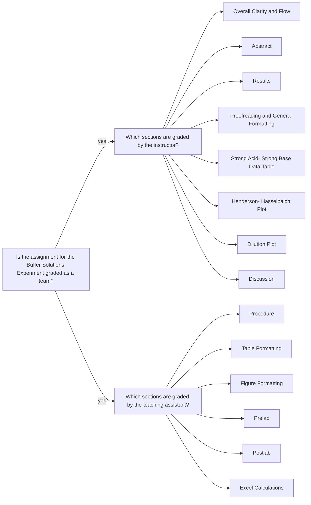

<a class="button button--primary button--pill" href="/tpv">SSQ20 CHE 139</a>
`Experiment 6`{:.success}

__Table of Contents__

* TOC (numbered)
{:toc}

## 1 Goals

### 1.1 Prepare the buffers A1-E1

- Calculate the concentration of each component present in buffers A1-E1 using the concentration of each stock solution, the volume of each solution delivered, and the total volume of buffer created.

Solution | Volume (mL) of $$CH_3COOH$$ or $$NH_4Cl$$ | Volume (mL) of $$CH_3COONa$$ or $$NH_3$$ |
|:-:|:-:|:-:|
A1 | 15.00 | 15.00 |
B1 | 20.00 | 10.00 |
C1 | 25.00 | 5.00 |
D1 | 5.00 | 25.00 |
E1 | 10.00 | 20.00 |

### 1.2 Generate the plot of pH vs. $$ \log \frac{ [base] }{ [acid] } $$

- Fit the data to a line (i.e. trendline). 
- Calculate the slope (3 sig. figs required) using `=SLOPE()` function in Excel.
- Calculate the intercept (3 sig. figs required) using `=INTERCEPT()` function in Excel.

### 1.3 Generate the plot pH vs. the logarithm of the dilution factor

- Generate a single scatter plot of pH vs. the logarithm of the dilution factor (1, 10, 100) for each buffer component using Excel.
- Both data sets should be presented on the same plot.
- Do not fit the data to a trendline.

## 2 Assignment

- Watch pH meter calibration video
- Watch the videos, pass the postlab quiz, and download your data set for Experiment 6
- Analyze the data in Excel
- Submit your partial lab report in a PDF file and all calculations in an Excel file.
- You should review the `Lab Report Guidelines`, `Sample General Chemistry Lab Report`, and `Appendix E` on D2L while writing to ensure that your drafts are correctly formatted.

## 3 Q&As

### 3.1 Total volumes of buffer solutions

> I'm not confident which volumes I should use as my volume delivered and total volume. Should I add the volumes of $$NH_4Cl$$ and $$NH_3$$ together as my volume delivered? In my Excel calculations, I then added 75mL from $$HCl$$ for my total volume for A1, C1, and D1. The procedure mentions adding $$HCl$$ to A1, C1, and D1, but I'm not sure what I need to incorporate into my total volume for B1 and E1 since the procedure doesn't say much else about them, or what to do with A2.

First of all, please try to make your questions more concise. It is a little hard to follow what is being asked here. Perhaps, sending your existing work might help clarify your confusion easier.

According to Table 2, solution A1 has the following total volume:

$$
  V_{tot, A1} = V_{CH_3COOH \text{ or } NH_4Cl} + V_{CH_3COONa \text{ or } NH_3} \notag
$$

$$
  V_{tot, A1} = (15.00 \text{ mL}) + (15.00 \text{ mL}) = 30.00 \text{ mL} \notag
$$

Likewise, sum the volume values of each species for B1, C1, D1, and E1 to calculate their respective $$V_{tot}$$ values.  

Next step is about addition of $$HCl$$ solution. `Obtain 75 mL of 0.10 M hydrochloric acid and 75 mL of 0.10 M sodium hydroxide. Add 10 mL of hydrochloric acid to solutions A1, C1, D1, and Water 1.`

I will show the volume calculation for A1 only. 10.00 mL $$HCl$$ solution is added to A1. Thus:

$$
  V_{tot, A1 \text{ with } HCl} = V_{tot, A1} + V_{HCl} \notag
$$

$$
  V_{tot, A1 \text{ with } HCl} = (30.00 \text{ mL}) + (10.00 \text{ mL}) = 40.00 \text{ mL} \notag
$$

## 4 Assessment

### 4.1 Misconceptions

#### 4.1.1 Henderson-Hasselbalch plot

- The plot should have one data series
- Variables are confused:
  - $$x-$$axis should be $$ \log \frac{ [base] }{ [acid] } $$. 
    - One refers to this variable as `Henderson-Hasselbalch constant`. 
      - How can a constant be a variable at the same time, plotted in the $$x-$$axis?
      - So, common sense can easily avoid some confusions[^1].
  - See the relevant instructions [above](/fbo#12-generate-the-plot-of-ph-vs-log-frac-base--acid-).  

[^1]: Being confused is good because it means you are learning. _Can you learn without thinking? Can you think without any confusion? Can you get confused without any desire to learn?..._  

> Log[base/acid]

It should be $$ \log \frac{ [base] }{ [acid] } $$. Bracket represents molarity. Bracket of base/acid does not represent molarity.

#### 4.1.2 Dilution plot

- Variables are confused:
  - $$x-$$axis should be $$ \log (\text{dilution factor}) $$.
  - See the relevant instructions [above](/fbo#13-generate-the-plot-ph-vs-the-logarithm-of-the-dilution-factor).

### 4.3 Formatting Issues

> NH3 and NH4

Should be $$NH_3$$ and $$NH_4$$

#### 4.3.1 Data table

- Sig. fig. errors. For example:
  - Presented: 
    - 0 mL
    - 5 mL
  - Expected:
    - 0.00 mL
    - 5.00 mL  
- Title is missing

### 4.4 Feedback

- The PDF file you uploaded: annotations are highlighted with gray background and pink font.
- E-Rubric: D2L will show the rubric with scores and any feedback provided.

### 4.5 Grades 

| Term Statistics[^1] |	Average | Stdev |	Median |	Maximum |	Minimum |
|:-:|:-:|:-:|:-:|:-:|:-:|
| SSQ 2020            |	88.55%  | 8.19% |	91.80% |	100.00% |	73.00% |

[^1]: All zero values are excluded.

### 4.6 Team grading

If you have any questions regarding your scores, please let [me](mailto:mkahveci@depaul.edu) or your [TA](mailto:brownt1129@gmail.com) know.