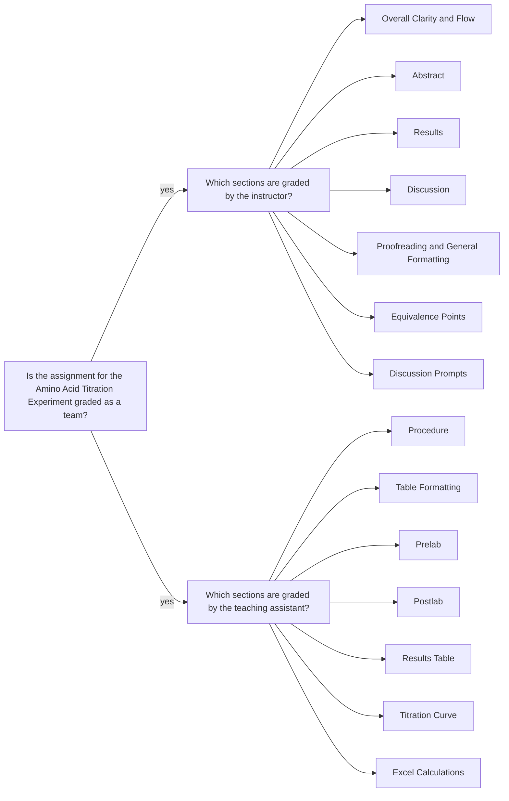

<a class="button button--primary button--pill" href="/tpv">SSQ20 CHE 139</a>
`Experiment 8`{:.success}

__Table of Contents__

* TOC (numbered)
{:toc}

## 1 Goals

### 1.1 Identification of the unknown amino acid

- Plot a graph of $$pH$$ vs. $$V(mL)$$ of $$NaOH$$ added. 
- If a break (or breaks, in the case of polyprotic acids) is clearly visible, estimate the pKa (or multiple $$pKa$$ values in the case of polyprotic acids).
- Use the example titration curve in the previous slide as a guidance:
  - The vertical dashed line shows equivalence point and corresponding $$NaOH$$ volume.
  - The horizontal dashed line shows $$pH$$ value, which is equal to $$pKa$$ value. So, you determined the $$pKa$$ value. 
  - Repeat this process for each break if you have multiple breaks and determine all $$pKa$$ values.  
- Estimate the molar mass of the acid. 
- Use these data to find a match in Table 2, Table 3, or Table 4.

### 1.2 Calculate the molar mass of the acid

- At the equivalence point:

\begin{equation}
  \text{mol } OH^- = \text{mol amino acid}
\end{equation}

which means:

\begin{equation}
  \text{volume of } OH^- \times \frac{\text{mol } OH^-}{ \text{L} } \times \frac{ 1 \text{ mol amino acid}}{ 1 \text{ mol } OH^-} = \text{mol amino acid} 
\end{equation}

- Calculate molar mass using the moles of amino acid and the mass of sample.

\begin{equation}
  \text{molar mass of amino acid} = \frac{\text{g amino acid}}{\text{mol amino acid}}
\end{equation}

### 1.3 Determine the identity of amino acid

- Using the $$pKa$$ and molar mass values determine the identity of amino acid.
- Find a match in Table 2, Table 3, or Table 4.

## 2 Assignment

- Watch the videos, pass the postlab quiz, and download your data set.
- Analyze the data in Excel
- Submit your partial lab report in PDF and all calculations in Excel file.
- You should review the `Lab Report Guidelines`, `Sample General Chemistry Lab Report`, and `Appendix E` on D2L while writing to ensure that your drafts are correctly formatted.

## 3 Q&As

### 3.1 The unknown amino acid I found doesn't match 

> The molar mass of the unknown amino acid I found doesn't match any of the options in Tables 2-4. My unknown number is `XYZ` [hidden for general post]. I'm unable to figure out which calculation I am not doing correctly and have attached my Excel file. Based on my graph, I think I have a monoprotic acid and that I did do the calculation correctly since the break is approximately `XYZ` [hidden for general post] and my calculated molar mass is `XYZ` [hidden for general post].

Reviewing your calculations in Excel reveals that you are pretty much okay with the methodology. I would double-check the values such as the mass of sample, etc. If they are okay, then you can leave this analysis as is. Hint: Your calculated molar mass is much smaller than its actual value. So, I would not rely on molar mass if everything is correct, and it stays as is. Finding the correct half-way(s) might be much more helpful.

With respect to finding the half-way points, I would make the plot much larger. Only then, you would see that there are more than one half-way points.

## 4 Assessment

### 4.1 Feedback

- The PDF file you uploaded: annotations are highlighted with gray background and pink font.
- E-Rubric: D2L will show the rubric with scores and any feedback provided.

### 4.2 Grades 

| Term Statistics[^1] |	Average | Stdev |	Median |	Maximum |	Minimum |
|:-:|:-:|:-:|:-:|:-:|:-:|
| SSQ 2020            |	89.47%  | 8.74% |	92.00% |	99.00% |	72.50% |

[^1]: All zero values are excluded.

### 4.3 Team grading 

If you have any questions regarding your scores, please let [me](mailto:mkahveci@depaul.edu) or your [TA](mailto:brownt1129@gmail.com) know.