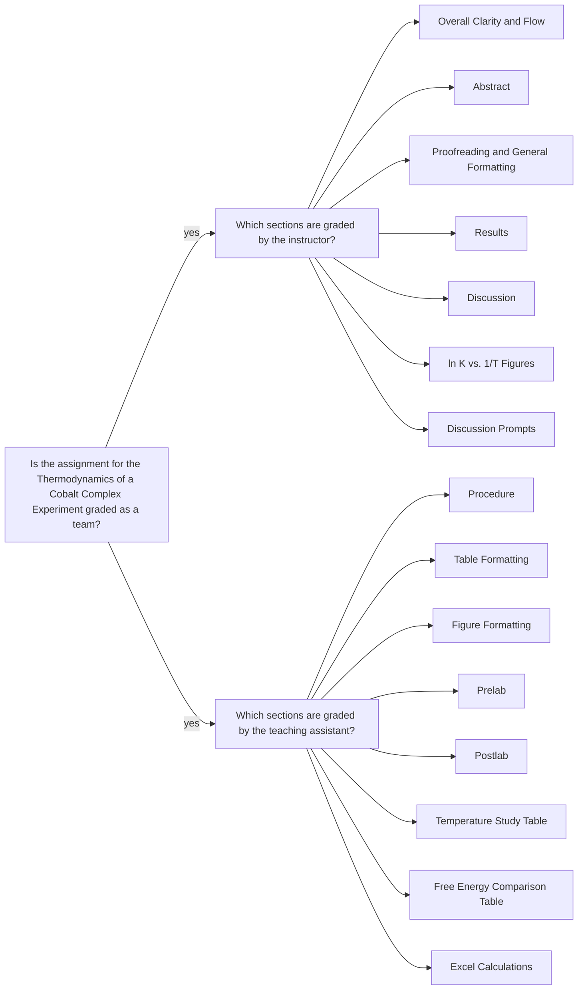

<a class="button button--primary button--pill" href="/tpv">SSQ20 CHE 139</a>
`Experiment 9`{:.success}

__Table of Contents__

- TOC (numbered)
{:toc}

## 1 Goals

### 1.1 Calculate the equilibrium concentration

- Calculate the equilibrium concentration of tetrachlorocobaltate(II) in solution at each temperature using Beer’s law with the measured absorbance value at the temperature of interest.

\begin{equation}
  A = abc
\end{equation}

- Assume that the molar absorptivity, $$ b $$, of $$CoCl_2^-$$ in water at 690 nm is constant ($$ 6.00 \times 10^2 $$ $$M^{-1}.cm^{-1}$$ for all 4 temperature values.
- The path length, $$ a $$, is equal to 1.00 cm.

- The equilibrium concentration of uncomplexed cobalt(II), $$Co^{2+}$$,  ions in solution at any given temperature is found using conservation of mass, the initial concentration of cobalt(II) ions in the stock solution, and the equilibrium concentration of tetrachlorocobaltate(II) at that temperature.

### 1.2 Calculate the equilibrium constant

- Calculate the equilibrium constant for the reaction of interest at each temperature using Equation \ref{eq:K}.

\begin{equation}\label{eq:K}
  K = \frac{[ CoCl_4^{2-} ]}{[ Co^{2+} ][ Cl^- ]^4}
\end{equation}

In doing this calculation, assume that the $$[Cl^-]$$ is constant due to the presence of strong 6.00 M $$HCl$$ acid. For the sake of significant figures in this calculation, assume the concentration of $$HCl$$ is exactly 6.00 M.

### 1.3 Calculate the equilibrium concentration of uncomplexed cobalt(II)

\begin{equation}\label{eq:CoII}
  Co^{2+}(aq) + 4 Cl^-(aq) \Leftrightarrow CoCl_4^{2-}(aq)
\end{equation}

The equilibrium concentration of uncomplexed cobalt(II), $$Co^{2+}$$, ions in solution at any given temperature is found using conservation of mass (i.e. the stoichiometric calculation based on Eqation \ref{eq:CoII}), the initial concentration of cobalt(II) ions in the stock solution, and the equilibrium concentration of tetrachlorocobaltate(II) at that temperature.

### 1.4 Calculate $$ \Delta G^\circ $$ using $$K$$

- Calculate $$ \Delta G^\circ $$ at each temperature studied for each trial using Equation \ref{eq:deltaG}.

\begin{equation}\label{eq:deltaG}
  \Delta G^\circ = - RT \ln K
\end{equation}

where $$ R = 8.3145 \text{ J/mol.K} $$ (use all figures to ensure proper significant figures), and all temperature values are in Kelvin.

### 1.5 Make $$ \ln K $$ vs. $$ 1/T $$ plots

- Make $$ \ln K $$ vs. $$ 1/T $$ plots for each trial separately.
- Temperature values are in Kelvin.
- Using the Excel formulas, calculate slope, `=SLOPE()`, and intercept `=INTERCEPT()` for the line of best fit.
- Calculate $$ \Delta H^\circ $$ and $$ \Delta S^\circ $$ for each trial using Equation \ref{eq:lnK}.

\begin{equation}\label{eq:lnK}
  \ln K = - \Big( \frac{\Delta H^\circ}{R} \Big)\Big( \frac{1}{T} \Big) + \Big( \frac{\Delta S^\circ}{R} \Big)
\end{equation}

where $$ \text{slope} =  - \Big( \frac{\Delta H^\circ}{R} \Big) $$, $$ y-\text{intercept} =  \Big( \frac{\Delta S^\circ}{R} \Big) $$, $$ R $$ is in energy unit like in Equation \ref{eq:deltaG}, and temperature is in Kelvin.

### 1.6 Calculate $$ \Delta G^\circ $$ using $$ \Delta H^\circ $$ and $$ \Delta S^\circ $$

- Calculate $$ \Delta G^\circ $$ at each temperature studied for each trial using Equation \ref{eq:deltaGthm}.

\begin{equation}\label{eq:deltaGthm}
  \Delta G^\circ = \Delta H^\circ - T \Delta S^\circ
\end{equation}

where $$ T $$ is in Kelvin. 

- Assume that $$ \Delta H^\circ $$ and $$ \Delta S^\circ $$ are constant with temperature.

### 1.7 Generate a combined plot of $$ \ln K $$ vs. $$ 1/T $$

- Generate a combined plot of $$ \ln K $$ vs. $$ 1/T $$. In this plot, you should include the results from all trials.

## 2 Assignment

- Watch the videos, pass the postlab quiz, and download your data set
- Analyze the data in Excel
- Submit your __full lab report__ in a PDF file and __calculations__ in an Excel file.
  - Be sure to fully discuss your results.
    - Compare the values from the two trials and discuss how similar or different they are, as well as potential reasons for differences observed.
    - Discuss the values of $$ \Delta G^\circ $$: are the values obtained similar for each type of calculation? Why might they be different?
  - There are two discussion prompts that should be incorporated into your overall discussion
    - One relates to the signs of $$ \Delta H^\circ $$ and $$ \Delta S^\circ $$, and why the signs you obtained do or do not follow your expectations.
    - The other relates to the conditions for spontaneity. Remember that $$ \Delta H^\circ $$ and $$ \Delta S^\circ $$  relate to standard state conditions when you calculate the temperature range over which the reaction will occur spontaneously. 
- You should review the `Lab Report Guidelines`, `Sample General Chemistry Lab Report`, and `Appendix E` on D2L while writing to ensure that your drafts are correctly formatted.

## 3 Q&As

### 3.1 Calculating the equilibrium concentration of $$Co^{2+}$$

> I had a question on how to calculate the equilibrium concentration of $$Co^{2+}$$. In the lab, it gives a brief description but no equation.

To answer this question, a new subsection was added to this document. Please [see](/evj#13-calculate-the-equilibrium-concentration-of-uncomplexed-cobaltii): Calculate the equilibrium concentration of uncomplexed cobalt(II)

## 4 Assessment 

### 4.1 Feedback

- The PDF file you uploaded: annotations are highlighted with gray background and pink font.
- E-Rubric: D2L will show the rubric with scores and any feedback provided.

### 4.2 Grades 

| Term Statistics[^1] |	Average | Stdev |	Median |	Maximum |	Minimum |
|:-:|:-:|:-:|:-:|:-:|:-:|
| SSQ 2020            |	79.30%  | 13.65% |	76.17% |	97.00% |	52.83% |

[^1]: All zero values are excluded.

### 4.3 Team grading 

If you have any questions regarding your scores, please let [me](mailto:mkahveci@depaul.edu) or your [TA](mailto:brownt1129@gmail.com) know.