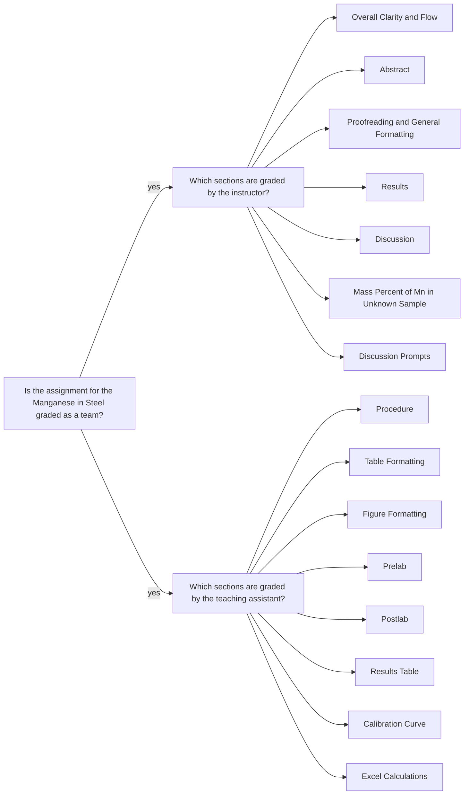

<a class="button button--primary button--pill" href="/tpv">SSQ20 CHE 139</a>
`Experiment 10`{:.success}

__Table of Contents__

* TOC (numbered)
{:toc}

## 1 Goals

### 1.1 Generate the standard curve

- Mass by difference calculate the mass of the known steel sample.
- The percent by mass of the known steel sample is known as 0.94% Mn.
  - Using the mass of the known steel sample and the weight to weight percent of Mn in this sample, calculate the mass and moles of Mn in the sample. Use Equation \ref{eq:massMn} and \ref{eq:molMn}.

\begin{equation}\label{eq:massMn}
  m_{Mn} \text{ (g)} = m_\text{known sample} \text{ (g)} \times \frac{0.94 \text{ g } Mn}{100 \text{ g steel sample}}
\end{equation}

\begin{equation}\label{eq:molMn}
  n_{Mn} \text{ (mol)} = m_{Mn} \text{ (g)} \times \frac{1 \text{ mol } Mn}{54.938049 \text{ g } Mn}
\end{equation}

  - Calculate the molarity of known steel sample solution using Equations \ref{eq:molMnO4} and \ref{eq:molarMnO4}.

\begin{equation}\label{eq:molMnO4} 
  n_{MnO_4^-} \text{ (mol)} = n_{Mn} \text{ (mol)}
\end{equation}

\begin{equation}\label{eq:molarMnO4}
  [MnO_4^-] = \frac{n_{MnO_4^-} \text{ (mol)}}{ 0.25000 \text{ L solution} }
\end{equation}

- Using \ref{eq:dilution} calculate the concentrations of each diluted solutions of $$MnO_4^-$$. Remember that the dilutions were 3:1, 2:2, and 1:3 volume to volume ratio. 

\begin{equation}\label{eq:dilution}
  M_1 V_1 = M_2 V_2
\end{equation}

- Generate a standard curve (absorbance at  525 nm vs. concentration of $$MnO_4^-$$ in M) for the solutions of known $$MnO_4^-$$ concentration.
  - In doing so, add 0 absorbance, 0 molar values as well. 
  - Thus, in total there are five data points in this plot.

### 1.2 Determine the molar absorptivity

- Apply trendline analysis over the standard curve.
- Following Beer’s Law, Equation \ref{eq:beers}, the slope of the plot determines the molar absorptivity $$a$$ of $$MnO_4^-$$. See Equation \ref{eq:a}

\begin{equation}\label{eq:beers}
A = abc
\end{equation}

where the path length, $$b=1.00$$ cm.

\begin{equation}\label{eq:a}
a = \frac{ \text{slope} }{ \text{1 cm} }
\end{equation}

### 1.3 Calculate the concentration of unknown steel solution

- Use Equation \ref{eq:beers} to calculate the concentration, $$c$$ of $$MnO_4^-$$.
- Probably your data has three trials of absorbance value.
- Repeat this calculation over all trials.
- Calculate the average concentration of $$MnO_4^-$$, and also report the standard deviation.

### 1.4 Calculate %Mn in the unknown steel sample

- This is a straightforward calculation as you will be plugging in the average concentration of $$MnO_4^-$$ in Equation \ref{eq:percentMn}

\begin{equation}\label{eq:percentMn}
  \text{percent Mn} = \frac{ (V_{MnO_4^-})([MnO_4^-]) }{ m_\text{sample}}
    \Big( \frac{ \text{1 mol Mn} }{ \text{1 mol } MnO_4^- } \times \frac{ 54.938049 \text{ mol Mn} }{ \text{1 mol Mn} } \Big) \times 100
\end{equation}

where $$ m_\text{sample} $$ is the mass of unknown sample; $$V_{MnO_4^-}$$ is the total volume of unknown sample solution, which is 250.00 mL; $$[MnO_4^-]$$ is the average concentration of $$MnO_4^-$$ in the unknown solution (calculated in subsection [1.3](/ksm#13-calculate-the-concentration-of-unknown-steel-solution)).

## 2 Assignment

- Compare the molar absorptivity from your plot to the literature value
given in the lab instructions.
- Read the lab instructions carefully so you can explain why you do or do not have to worry about $$Cu^{2+}$$ and $$Ni^{2+}$$ ions interfering with your results.
- Think through how a molar absorptivity that is too low would affect your results. To answer this correctly, follow the computational steps to make sure you can clearly state if an a value that is too small will lead to a higher or lower percent Mn than the correct value.
- Incorporate the responses to the above prompts in your overall discussion. Be sure to discuss the quality of your fit, the spread in the absorbance readings for the unknown, etc. to ensure your discussion is complete.
- Watch the videos, pass the postlab quiz, and download your data set.
- Submit your __full lab report__ in a PDF file and __calculations__ in an Excel file.
- You should review the `Lab Report Guidelines`, `Sample General Chemistry Lab Report`, and `Appendix E` on D2L while writing to ensure that your drafts are correctly formatted.

## 3 Q&As

### 3.1 Taking the prelab quiz

> Is there anyway you can give me an example of how to enter the answers for the calculations? I just can’t seem to figure that out.

Please pay attention to the values of calculations. The values should be entered with correct significant figures and units. Units are case sensitive. Use the SI unit conventions.

For example:

- `1250` is not equal to `1250.`
- `L` is not equal to `l`

### 3.2 Calculations

> I would like to attend your office hours at 4pm tomorrow to ask a couple questions about the calculations for Experiment 10.

After this meeting, the [Goals](/ksm#1-goals) section was revised. Although the lecture notes were elaborate enough, now this page has more details with relevant formulae, for those of whom are confused[^1]. 

[^1]: Being confused is good because it means you are learning. _Can you learn without thinking? Can you think without any confusion? Can you get confused without any desire to learn?..._

### 3.3 The unit of absorbance

> I was wondering if there are units that are necessary for the absorbance values on the figure needed for this lab.

Absorbance does not have a unit. The absorbance, $$A$$, is defined by the incident intensity, $$I_0$$, and transmitted intensity, $$I$$.

$$
  A = \log_{10} \Big( \frac{I_0}{I} \Big)
$$

Overall, the equation shows no unit.

### 3.4 The concentration of undiluted solution

> I am confused on where the fifth point on the standard curve graph comes from. I know that there is supposed to be a point where it is at the origin so I added that in the curve but since the volume of the diluted water is 0 isn’t the concentration of $$MnO_4^-$$ also 0? If it is then it is way off the trend line and I don’t know what I did wrong. Please let me know if you can help me figure out what I did wrong that made the point for 1.610 absorbance have 0 concentration.

I suspect a `potential misunderstanding` here. When there is an aqueous solution, it is mostly water. Water is the `solvent`, so by definition solvent is in abundance. When the solution is diluted, more water added. This is an important point to understand about aqueous solutions.

Undiluted solution has the highest concentration. Follow Equations \ref{eq:massMn}, \ref{eq:molMn}, \ref{eq:molMnO4}, and \ref{eq:molarMnO4} to calculate the molarity of permanganate. This value is the undiluted concentration, in which the highest absorbance ($$A$$) value is observed.

### 3.5 Dilution formula

> I just wanted to follow up on my last email. I read the questions page and I am still confused on how the concentration is less than the concentration multiplied by three. Because of the dilution formula where $$M_2=\frac{M_1 \times V_1}{V_2}$$ wouldn’t the one with the highest volume standard with the lowest volume DI water had the highest value. I am sorry if I am getting confused on something simple here.

You are applying the dilution formula incorrectly. You should follow the following steps to find and plug in the correct $V$ values. I am using the second row of your data table.

- $$V_1 = 30.00 $$ mL of the stock $$MnO_4^-$$ solution.
- Add 10.00 mL of DI water.
- Final volume becomes $$V_2 = 40.00 $$ mL of diluted $$MnO_4^-$$ solution.
- In sum, you should plug in the following values:
  - $$V_1 = 30.00 $$ mL
  - $$V_2 = 40.00 $$ mL
  - $$M_1 = 0.0005126 $$ M based on your first row. (Please check this calculation, the concentration value looks too low.)

## 4 Assessment 

### 4.1 Feedback

- The PDF file you uploaded: annotations are highlighted with gray background and pink font.
- E-Rubric: D2L will show the rubric with scores and any feedback provided.

### 4.2 Grades 

| Term Statistics[^1] |	Average | Stdev |	Median |	Maximum |	Minimum |
|:-:|:-:|:-:|:-:|:-:|:-:|
| SSQ 2020            |	84.06%  | 10.24% |	86.67% |	95.83% |	57.33% |

[^1]: All zero values are excluded.

### 4.3 Team grading 

If you have any questions regarding your scores, please let [me](mailto:mkahveci@depaul.edu) or your [TA](mailto:brownt1129@gmail.com) know.