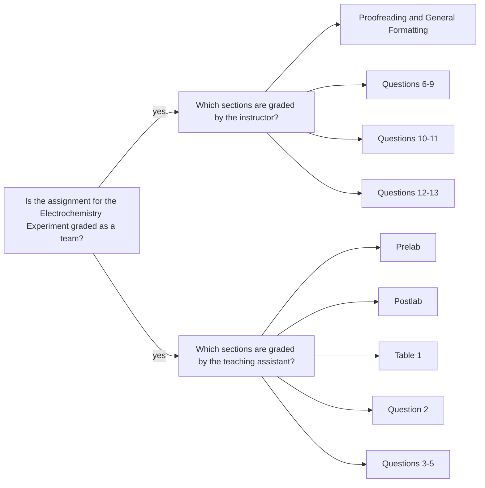

<a class="button button--primary button--pill" href="/tpv">SSQ20 CHE 139</a>
`Experiment 11`{:.success}

__Table of Contents__

* TOC (numbered)
{:toc}

## 1 Goals

- It is important that you identify the cathode and anode half-reactions for each galvanic cell before beginning the following calculations.

### 1.1 Experimental $$E$$ for $$Cu$$

- From the standard reduction potential, $$E^\circ$$, of the copper half-reaction of 0.340 V and the concentration of $$Cu^2+$$, calculate the actual value of $$E$$ for the experimental copper half-reaction using the Nernst equation (Equation \ref{nerst}).

\begin{equation}\label{nerst}
  E_\text{red} = E_\text{red}^\circ - \Big( \frac{RT}{nF} \Big) \ln \Big( \frac{1}{[M^{n+}]} \Big)
\end{equation}

### 1.2 Experimental $$E$$ for $$Al$$

From the actual value of E for the experimental copper half-reaction and the measured value of Εcell for the copper-aluminum cell, determine the value of E for the experimental half-reaction for aluminum (Equation \ref{Ecell}).

\begin{equation}\label{Ecell}
  E_\text{cell} = E_\text{cathode} - E_\text{anode}
\end{equation}

### 1.3 Experimental $$E^\circ$$ for $$Al$$

From the calculated value of $$E$$ for the experimental aluminum half-reaction and the actual
concentration of $$Al^{3+}$$, calculate $$E^\circ$$ for the aluminum half-reaction using the Nernst equation (Equation \ref{nerst}).

### 1.4 Experimental $$E$$ for $$Zn$$

From the actual value of $$E$$ for the experimental copper half-reaction and the measured value of Εcell for the copper-zinc cell, determine the value of E for the experimental half-reaction for zinc (Equation \ref{Ecell}).

### 1.5 Experimental $$E^\circ$$ for $$Zn$$

From the calculated value of $$E$$ for the experimental zinc half-reaction and the actual concentration
of $$Zn^{2+}$$, calculate $$E^\circ$$ for the zinc half-reaction using the Nernst equation (Equation \ref{nerst}).

### 1.6 Experimental $$E$$ for $$Pb$$

From the actual value of $$E$$ for the experimental copper half-reaction and the measured value of Εcell for the copper-lead cell, determine the value of $$E$$ for the experimental half-reaction for lead (Equation \ref{Ecell}).

### 1.7 Experimental $$E^\circ$$ for $$Pb$$

From the calculated value of E for the experimental lead half-reaction and the actual concentration
of $$Pb^{2+}$$, calculate $$E^\circ$$ for the lead half-reaction using the Nernst equation (Equation \ref{nerst}).

### 1.8 Internal Consistency Check

Using the experimental $$E$$ values for zinc and lead calculated above, calculate $$E_\text{cell}$$. Compare this result to the value you measured.

## 2 Assignment

- Watch the videos, pass the postlab quiz, and download your data set.
- Analyze the data in Excel.
- Submit your worksheet in a PDF file.
- You should review the `Lab Report Guidelines`, `Sample General Chemistry Lab Report`, and `Appendix E` on D2L while writing to ensure that your drafts are correctly formatted.

## 3 Q&As

### 3.1 Printing off the worksheets

> I was wondering if I may print off the worksheets for Experiments 11 and 12, hand write them and then upload them as a pdf file as I did for a previous experiment. In the lab guide, it says you may either write or type your responses, but other places it says that they must be typed. Thank you for the clarification!

Yes, you may print and fill out them. However, if any part of the worksheet requires you to copy and paste a graph, you should print and attach the graphs physically. One drawback for this approach is that you may not have enough space to attach a graph. In that case, you could add your graph as a separate page and make sure that you refer to the page in the given space, where you are expected tp provide the graph.

## 4 Assessment 

### 4.1 Feedback

- The PDF file you uploaded: annotations are highlighted with gray background and pink font.
- E-Rubric: D2L will show the rubric with scores and any feedback provided.

### 4.2 Grades 

| Term Statistics[^1] |	Average | Stdev |	Median |	Maximum |	Minimum |
|:-:|:-:|:-:|:-:|:-:|:-:|
| SSQ 2020            |	82.71%  | 9.01% |	85.40% |	96.08% |	62.07% |

[^1]: All zero values are excluded.

### 4.3 Team grading 

If you have any questions regarding your scores, please let [me](mailto:mkahveci@depaul.edu) or your [TA](mailto:brownt1129@gmail.com) know.