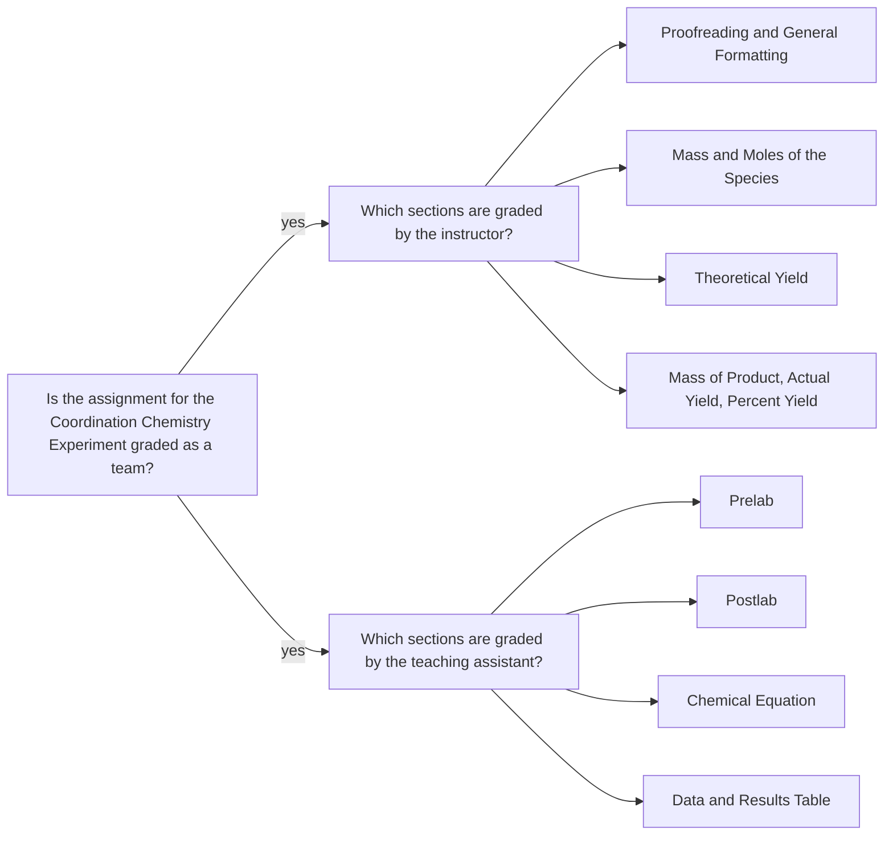

<a class="button button--primary button--pill" href="/tpv">SSQ20 CHE 139</a>
`Experiment 12`{:.success}

__Table of Contents__

* TOC (numbered)
{:toc}

## 1 Goals

### 1.1 Mass of Copper(II) Sulfate Pentahydrate

Calculate the mass of copper(II) sulfate pentahydrate used in the reaction from the initial and final mass of the reagent vial.

### 1.2 Moles of Copper(II) Sulfate Pentahydrate

Calculate the moles of copper(II) sulfate pentahydrate used in the reaction using the mass and the molar mass of the compound.

### 1.3 Moles of Ammonia Added

Calculate the moles of ammonia added using the volume added and the molarity of the solution.

### 1.4 Theoretical Yield of Tetraamminecopper(II) Sulfate Monohydrate

Calculate the theoretical yield (in moles) of tetraamminecopper(II) sulfate monohydrate produced from the limiting reagent and the relevant balanced chemical equation.

### 1.5 Mass of Product Collected

Calculate the mass of the collected product from the initial and final mass of the beaker.

### 1.6 Actual Yield of Tetraamminecopper(II) Sulfate Monohydrate

Assuming that all of the collected solid was the product of interest, calculate the actual yield (in moles) of the reaction from the mass of the product and the molar mass of tetraamminecopper(II) sulfate monohydrate.

### 1.7 Percent Yield

Calculate the percent yield of the reaction using the theoretical and actual yields.

## 2 Assignment

- Watch the videos, pass the postlab quiz, and download your data set.
- Analyze the data in Excel.
- Submit your worksheet in a PDF file.
- You should review the `Lab Report Guidelines`, `Sample General Chemistry Lab Report`, and `Appendix E` on D2L while writing to ensure that your drafts are correctly formatted.

## 3 Q&As

### 3.1 Printing off the worksheets

> I was wondering if I may print off the worksheets for Experiments 11 and 12, hand write them and then upload them as a pdf file as I did for a previous experiment. In the lab guide, it says you may either write or type your responses, but other places it says that they must be typed. Thank you for the clarification!

My response is posted [here](/fwb#31-printing-off-the-worksheets).

## 4 Assessment 

### 4.1 Team grading

If you have any questions regarding your scores, please let [me](mailto:mkahveci@depaul.edu) or your [TA](mailto:brownt1129@gmail.com) know.