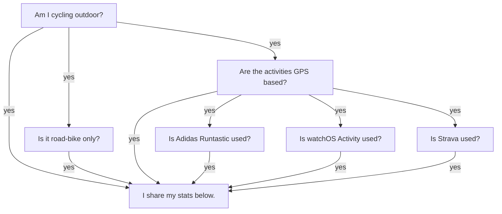



```mermaid
graph TB;
    A[Am I cycling outdoor?]
    B[I share my stats below.]
    C[Is it road-bike only?]
    D[Are the activities GPS based?]
    E[Is Adidas Runtastic used?]
    F[Is watchOS Activity used?]
    G[Is Strava used?]
    A--yes-->B;
    A--yes-->C;
    C--yes-->B; 
    A--yes-->D; 
    D--yes-->B; 
    D--yes-->E;
    E--yes-->B;
    D--yes-->F;
    F--yes-->B;
    D--yes-->G;
    G--yes-->B;
```


## All Logs


