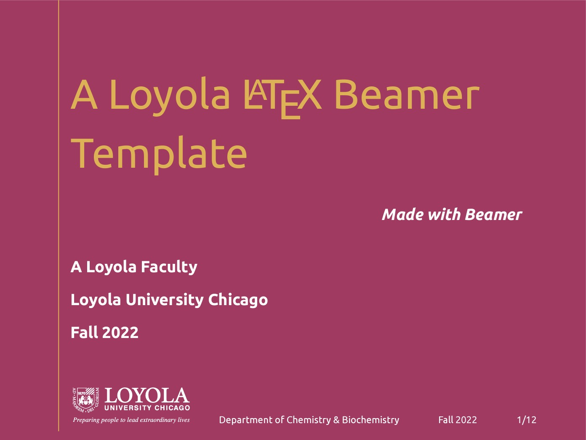

# A Loyola LaTeX Beamer Template

This template is dedicated to the Loyola University Chicago Community. You can view the sample PDF at [overleaf.com](https://github.com/mkahveci/loyola-beamer-template/tree/master/https://www.overleaf.com/latex/templates/a-loyola-latex-beamer-template/ydvmcbhfggcp.pdf). 

For making contributions, follow the regular GitHub workflow.  

* clone
* make a branch
* edit locally
* push, and 
* do a pull request with details of commits

You may contact me via [kahveci.pw](https://kahveci.pw/contact).

## Usage

* Visit [https://www.overleaf.com/latex/templates/a-loyola-latex-beamer-template/](https://www.overleaf.com/latex/templates/a-loyola-latex-beamer-template/ydvmcbhfggcp)
* Click `Open as Template`
* `Edit`
* `Compile` and download the `PDF` file.
* The Google Chrome browser offers a superior presentation mode from a PDF file.  

### Compilation Issues

Depending on local packages in your LaTeX installation, you may encounter compilation issues. However, [overleaf.com](https://www.overleaf.com/) compiles this template error-free. For individuals, free version of overleaf.com [subscription](https://www.overleaf.com/user/subscription/plans) is more than good enough.

## Credits

loyola-beamer.cls was inspired by [https://github.com/zhtluo/purdue-slide-template](https://github.com/zhtluo/purdue-slide-template) and written based on Beamer [Metropolis theme](https://ctan.org/pkg/beamertheme-metropolis?lang=en). 

The University name and logos are owned by Loyola University Chicago [https://www.luc.edu/umc/brandstandards/graphicidentity/downloads/](https://www.luc.edu/umc/brandstandards/graphicidentity/downloads/)

Enjoy!

